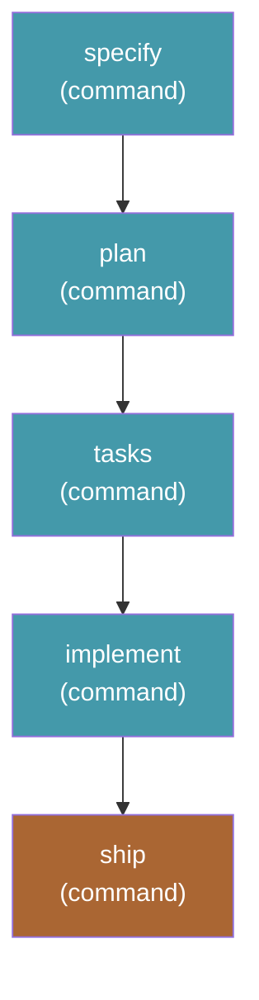
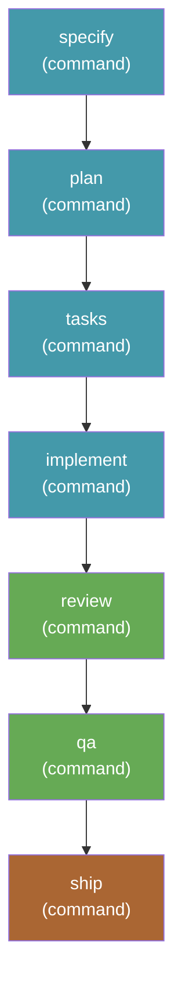

# `send-it` Bundle Implementation Plan

> **For agentic workers:** REQUIRED SUB-SKILL: Use superpowers:subagent-driven-development (recommended) or superpowers:executing-plans to implement this plan task-by-task. Steps use checkbox (`- [ ]`) syntax for tracking.

**Goal:** Publish a `send-it` Spec Kit bundle from this repo that installs four third-party extensions plus two new workflows, so `specify workflow run send-it -i spec="…"` carries a change from nothing to an open GitHub pull request unattended.

**Architecture:** Everything is declarative repo content — no runtime code. Two workflow manifests join the existing `workflows/` catalog stack; a new `extensions/` catalog stack makes the four upstream extensions *installable* (the upstream community catalog lists them but is discovery-only, so the bundler refuses to install from it); a new `bundles/` catalog stack publishes the bundle manifest as a built `.zip` release asset. `scripts/validate_catalog.py` is generalized from one hard-coded add-on type to three, and is the only executable deliverable — it is this repo's test suite.

**Tech Stack:** YAML manifests (`workflow.yml`, `bundle.yml`), JSON catalogs, Python 3.12 + PyYAML (validator), `specify` CLI 0.14.4 (`bundle validate` / `bundle build`), `gh` (releases).

## Global Constraints

Copied verbatim from the spec, plus values verified against source during planning. Every task's requirements implicitly include this section.

- **Repo slug:** `clintcparker/speckit-addons`. Raw base `https://raw.githubusercontent.com/clintcparker/speckit-addons`; blob base `https://github.com/clintcparker/speckit-addons/blob`.
- **Existing tag convention:** `<id>-v<version>` (e.g. `yolo-v0.1.1`). Bundle tags use the prefixed form `bundle-<id>-v<version>` — see "Decisions made during planning" below.
- **Catalogs live on `main`; install URLs pin to an immutable tag.** Never a branch.
- **Versions are per add-on**, not per repo. New add-ons start at `0.1.0`.
- **All new add-ons:** author `clintcparker`, license `MIT`.
- **Workflow `requires.speckit_version`:** `">=0.8.12"` (same floor as `yolo`; first release with engine-side `integration: "auto"` resolution).
- **Bundle `requires.speckit_version`:** `">=0.14.2"`. `requires.tools: ["git", "gh"]`.
- **Timestamps for new catalog entries:** `2026-07-30T00:00:00Z` (`created_at`) and `2026-07-30T00:00:00Z` (`updated_at`); each catalog's own top-level `updated_at` becomes `2026-07-30T00:00:00Z`.
- **Pinned upstream versions and digests** (verified 2026-07-30 by fetching the tag archives):

  | id | version | download_url | sha256 |
  |---|---|---|---|
  | `worktrees` | 1.3.2 | `https://github.com/dango85/spec-kit-worktree-parallel/archive/refs/tags/v1.3.2.zip` | `454939682d5f2014db2c8cd7a62b99bb124553981dd7b1d9b8e2ec814ba2130d` |
  | `ship` | 1.0.0 | `https://github.com/arunt14/spec-kit-ship/archive/refs/tags/v1.0.0.zip` | `ec6dab4d371819ea85002418a2d5ee0874dbffef7a4d499844b30a400e34d68e` |
  | `staff-review` | 1.0.0 | `https://github.com/arunt14/spec-kit-staff-review/archive/refs/tags/v1.0.0.zip` | `7c2a5c8cfbfdb0e5fa20d5c86efaf6ae16e344bf98b7a90d1ea63d0de99d2f8a` |
  | `qa` | 1.0.0 | `https://github.com/arunt14/spec-kit-qa/archive/refs/tags/v1.0.0.zip` | `90fa06c7d71da95f34385ef9f58632790f80af7c199a4054bb9bf4d921daaeb9` |

- **No `--check-urls` before the tag is pushed.** `raw.githubusercontent.com` caches negative responses for minutes, so an early request keeps 404ing after the tag lands.
- **Commit style:** short conventional-commit subjects, matching this repo's history (`Add send-it bundle design spec`, `yolo 0.1.1: correct speckit_version floor to >=0.8.12`).

## Decisions made during planning

Three points the spec left open or did not cover. Each is settled here with the verification behind it.

1. **`sha256` on extension catalog entries — supported, so include it.** The spec said "not available for extension entries unless upstream format supports it — verify during implementation." It *is* supported: `ExtensionCatalog.download_extension` calls `verify_archive_sha256(zip_data, ext_info.get("sha256"), …)`, and the upstream community catalog already carries `sha256` on two entries. Included for all four. Trade-off documented in `extensions/README.md`: GitHub's auto-generated `/archive/refs/tags/` zips are not contractually byte-stable (GitHub changed archive compression once before, invalidating checksums globally). If that recurs, installs fail loudly with a digest mismatch and the fix is to recompute and bump the catalog — a louder, better failure than a silently re-pointed tag installing different code with full privileges.

2. **Bundle release tags are prefixed: `bundle-send-it-v0.1.0`.** The spec's `<id>-v<version>` convention collides here — the *workflow* `send-it` 0.1.0 and the *bundle* `send-it` 0.1.0 would both want the tag `send-it-v0.1.0`. Sharing one tag works only while both stay in version lockstep forever. Bundle tags therefore take a `bundle-` prefix, encoded as a per-type `tag_prefix` in the validator. Workflow tags are unchanged.

3. **Three separate catalog registrations are required, and two of them replace the built-in stack.** Verified in source: `WorkflowCatalog.get_active_catalogs` and `ExtensionCatalog.get_active_catalogs` both *return* the project config's catalogs when `.specify/workflow-catalogs.yml` / `.specify/extension-catalogs.yml` exists — the built-in `default` + `community` sources are dropped, not merged. The bundler's `load_source_stack` is the odd one out: it merges by id over `BUILTIN_DEFAULT_STACK`. Also `specify extension catalog add` defaults to **`--no-install-allowed`**, so `--install-allowed` must be passed explicitly or the bundler refuses with "is from a discovery-only catalog". All three facts go in the install docs.

## Verified mechanism facts

Read from `specify-cli` 0.14.4 at `~/.local/share/uv/tools/specify-cli/lib/python3.12/site-packages/specify_cli/`. These justify the shapes below; do not re-derive them.

- `bundler/services/primitives.py` — `_ExtensionKindManager.install` resolves by **id** through `ExtensionCatalog`, rejects `_install_allowed: false`, and calls `_assert_pinned_version` comparing the manifest pin against the catalog's advertised `version`. `ComponentRef.source` is parsed in `models/manifest.py` but never read by any installer. Workflows route through `workflow_add(id)` with the same pin assertion against `WorkflowCatalog`.
- `extensions/__init__.py:2386-2405` — `install_from_zip` accepts a single top-level directory in the archive, so a GitHub tag zipball (`spec-kit-ship-1.0.0/extension.yml`) installs correctly.
- `extensions/__init__.py:3205` — an extension catalog payload must have top-level `schema_version` and an `extensions` **object**.
- `bundler/models/catalog.py:214-239` — a bundle catalog payload must have a top-level `bundles` **object**, and each entry's `id` must equal its key. `CatalogEntry` fields: `id`, `name`, `version`, `role`, `description`, `author`, `license`, `download_url`, `requires.speckit_version`, optional `sha256`, `provides`, `repository`, `tags`, `verified` (must be a real boolean).
- `bundler/services/packager.py:61` — `specify bundle build` emits a reproducible `<id>-<version>.zip` (fixed timestamps, normalized modes) containing every file in the bundle directory. It refuses without a `README.md`.
- `commands/bundle/__init__.py:1028-1044` — `_validate_catalog_manifest` rejects an install when the downloaded manifest's `bundle.id` / `bundle.version` disagree with the catalog entry.
- `extensions/__init__.py:4415-4444` — each extension hook is recorded in `.specify/extensions.yml` as a list entry under `hooks.<event>` with `extension`, `command`, `enabled: true`, `optional`, `priority` (default 10), `prompt`, `description`, `condition`. `get_hooks_for_event` filters on `enabled`. `specify extension disable <id>` is *not* a substitute — it also unregisters the commands, which the workflow steps need.
- Upstream `extension.yml` at the pinned tags confirms ids `worktrees` / `ship` / `staff-review` / `qa`, versions matching the pins, MIT licenses, `after_implement` hooks on ship/staff-review/qa (`optional: true`), and `after_specify` on worktrees (`optional: false`).
- `commands/run.md` for ship confirms: `$ARGUMENTS` is read first ("You **MUST** consider the user input before proceeding"); review/QA pre-flight is gated on `FEATURE_DIR/reviews/` and `FEATURE_DIR/qa/` existing; confirmations exist for the readiness summary, rebase/merge, push, CHANGELOG prepend, and PR creation; CI failure and rebase conflict are hard STOPs.
- `workflows/expressions.py:225` — `{{ … }}` interpolates *inside* a longer string, not only as a whole-string expression. Multi-line `args` with an embedded `{{ inputs.target_branch }}` is valid.

---

## File Structure

```
workflows/
  catalog.json                              MODIFY  +2 entries, bump updated_at
  README.md                                 MODIFY  +2 table rows, +release procedure for extensions/bundles
  send-it/
    workflow.yml                            CREATE  5 steps: specify plan tasks implement ship
    README.md                               CREATE
    CHANGELOG.md                            CREATE
  send-it-checked/
    workflow.yml                            CREATE  7 steps: + review, qa before ship
    README.md                               CREATE
    CHANGELOG.md                            CREATE
extensions/
  catalog.json                              CREATE  4 third-party entries, install-allowed
  README.md                                 CREATE  third-party risk + registration
bundles/
  catalog.json                              CREATE  1 entry -> release asset
  README.md                                 CREATE  layout + registration
  send-it/
    bundle.yml                              CREATE  4 extensions + 2 workflows
    README.md                               CREATE  install, run, post-install hook edit
    CHANGELOG.md                            CREATE
scripts/validate_catalog.py                 MODIFY  generalize to 3 add-on types
README.md                                   MODIFY  add-on tables + 3 registration commands
```

`.github/workflows/validate.yml` needs **no** change: its tag trigger is
`["*-v*"]`, which already matches `send-it-v0.1.0`, `send-it-checked-v0.1.0`,
and `bundle-send-it-v0.1.0`.

Responsibilities: `workflows/<id>/` owns one workflow's manifest and its docs. `extensions/catalog.json` owns nothing but pointers — this repo publishes no extension code. `bundles/send-it/` is the *only* directory packaged into the distributable artifact, so nothing that is not meant to ship may live there. `scripts/validate_catalog.py` owns the cross-checks between every catalog and the add-ons on disk.

---

### Task 1: `send-it` workflow

**Files:**
- Create: `workflows/send-it/workflow.yml`
- Create: `workflows/send-it/README.md`
- Create: `workflows/send-it/CHANGELOG.md`
- Modify: `workflows/catalog.json` (add `send-it` entry, bump top-level `updated_at`)
- Modify: `workflows/README.md:8-10` (add table row)
- Test: `scripts/validate_catalog.py` (existing, unmodified)

**Interfaces:**
- Produces: workflow id `send-it`, version `0.1.0`, tag `send-it-v0.1.0`. Inputs `spec` (string, required), `integration` (string, default `auto`), `target_branch` (string, default `main`). Step ids `specify`, `plan`, `tasks`, `implement`, `ship`. Task 4's `bundles/send-it/bundle.yml` pins `{ id: send-it, version: "0.1.0" }`; Task 3's validator cross-checks that pin against `workflows/catalog.json`.

- [ ] **Step 1: Add the catalog entry first, so the validator has something to fail on**

Insert into `workflows/catalog.json` inside the `workflows` object, after the `yolo` entry, and change the file's top-level `"updated_at"` to `"2026-07-30T00:00:00Z"`:

```json
    "send-it": {
      "id": "send-it",
      "name": "Spec to PR, unattended",
      "description": "specify → plan → tasks → implement → ship; no gates, ends in an open PR",
      "author": "clintcparker",
      "version": "0.1.0",
      "url": "https://raw.githubusercontent.com/clintcparker/speckit-addons/send-it-v0.1.0/workflows/send-it/workflow.yml",
      "repository": "https://github.com/clintcparker/speckit-addons",
      "homepage": "https://github.com/clintcparker/speckit-addons/tree/main/workflows/send-it",
      "documentation": "https://github.com/clintcparker/speckit-addons/blob/send-it-v0.1.0/workflows/send-it/README.md",
      "changelog": "https://github.com/clintcparker/speckit-addons/blob/send-it-v0.1.0/workflows/send-it/CHANGELOG.md",
      "license": "MIT",
      "requires": {
        "speckit_version": ">=0.8.12"
      },
      "tags": [
        "sdd",
        "full-cycle",
        "no-gates",
        "automation",
        "release",
        "pull-request"
      ],
      "created_at": "2026-07-30T00:00:00Z",
      "updated_at": "2026-07-30T00:00:00Z"
    },
```

Note the trailing comma placement: `yolo` must gain a trailing comma if `send-it` is added after it, or place `send-it` before `yolo`. JSON has no trailing comma on the last entry.

- [ ] **Step 2: Run the validator to verify it fails**

Run: `uv run --with pyyaml python scripts/validate_catalog.py`

Expected: FAIL with

```
  ✗ workflows/catalog.json [send-it]: no workflows/send-it/ directory on disk
```

- [ ] **Step 3: Write `workflows/send-it/workflow.yml`**

```yaml
schema_version: "1.0"
workflow:
  id: "send-it"
  name: "Spec to PR, unattended"
  version: "0.1.0"
  author: "clintcparker"
  description: "specify → plan → tasks → implement → ship; no gates, ends in an open PR"

requires:
  # Same floor as yolo: 0.8.12 is the first release with engine-side resolution
  # of ``integration: "auto"`` (spec-kit #2421). Older versions treat "auto" as
  # a literal integration key and fail at dispatch.
  speckit_version: ">=0.8.12"
  integrations:
    # Advisory compatibility hint, not a closed set -- see workflows/yolo.
    any:
      - "claude"

inputs:
  spec:
    type: string
    required: true
    prompt: "Describe what you want to build"
  integration:
    type: string
    default: "auto"
    prompt: "Integration to use (e.g. claude, copilot, gemini; 'auto' uses the project's initialized integration)"
  target_branch:
    type: string
    default: "main"
    prompt: "Branch the pull request should target"

steps:
  - id: specify
    command: speckit.specify
    integration: "{{ inputs.integration }}"
    input:
      args: "{{ inputs.spec }}"

  - id: plan
    command: speckit.plan
    integration: "{{ inputs.integration }}"
    input:
      args: "{{ inputs.spec }}"

  - id: tasks
    command: speckit.tasks
    integration: "{{ inputs.integration }}"
    input:
      args: "{{ inputs.spec }}"

  - id: implement
    command: speckit.implement
    integration: "{{ inputs.integration }}"
    input:
      args: "{{ inputs.spec }}"

  # speckit.ship.run is provided by the `ship` extension, not by core Spec Kit.
  # Its command reads $ARGUMENTS before anything else ("You MUST consider the
  # user input before proceeding"), which is the designed lever for turning a
  # safe-by-default interactive command into an unattended one.
  - id: ship
    command: speckit.ship.run
    integration: "{{ inputs.integration }}"
    input:
      args: >-
        Target branch: {{ inputs.target_branch }}.

        UNATTENDED RUN — no user is present and no prompt can be answered.
        Treat every confirmation this command would normally ask as answered
        YES and continue without waiting: the readiness summary, the
        rebase/merge confirmation, the push confirmation, the CHANGELOG
        prepend confirmation, and the pull request creation confirmation.

        Before the working-tree pre-flight check, commit every uncommitted
        change with a descriptive conventional-commit message instead of
        prompting to commit or stash.

        If any tasks in tasks.md are still incomplete, do not stop — proceed
        and list the incomplete tasks in the pull request description.

        Prefer rebase over merge when synchronizing with the target branch.

        Do not block on CI. If gh is unavailable, if no CI run exists yet for
        the branch, or if a run is still in progress, proceed and record the
        CI status in the pull request description rather than waiting. If CI
        has already failed, still open the pull request and call the failure
        out prominently in the description.

        The one legitimate stop is a rebase conflict that cannot be resolved
        trivially: leave the branch as it is for manual resolution and report
        what happened. Never force-push.
```

- [ ] **Step 4: Run the validator to verify it passes**

Run: `uv run --with pyyaml python scripts/validate_catalog.py`

Expected: `✓ <N> checks passed.` (N grows from 15 to roughly 24 — the exact count is not asserted, only the zero-failure exit.)

- [ ] **Step 5: Write `workflows/send-it/CHANGELOG.md`**

```markdown
# Changelog

All notable changes to the `send-it` workflow are documented here.

The format follows [Keep a Changelog](https://keepachangelog.com/en/1.1.0/), and
this workflow adheres to [Semantic Versioning](https://semver.org/spec/v2.0.0.html).

## [0.1.0] — 2026-07-30

First published release.

### Added

- Five `command` steps: `specify` → `plan` → `tasks` → `implement` → `ship`.
  The first four are `yolo`'s; `ship` is `speckit.ship.run` from the
  [`ship`](https://github.com/arunt14/spec-kit-ship) extension.
- `target_branch` input (default `main`), passed to the `ship` step.
- Unattended `args` prose for the `ship` step: auto-accept every confirmation,
  auto-commit the working tree, never block on CI, and stop only on a rebase
  conflict that cannot be resolved trivially.

[0.1.0]: https://github.com/clintcparker/speckit-addons/releases/tag/send-it-v0.1.0
```

- [ ] **Step 6: Write `workflows/send-it/README.md`**

```markdown
# send-it — spec to PR, unattended

Runs the complete Spec Kit cycle and then ships it: `specify` → `plan` →
`tasks` → `implement` → `ship`. No review gates, no confirmations, no pauses.
You describe what you want and come back to an open pull request.

```bash
specify workflow run send-it -i spec="add dark mode" -i target_branch=main
```

The pull request is the review gate. That is the whole design.

## What it needs

`send-it` calls `speckit.ship.run`, which is **not** a core Spec Kit command —
it comes from the third-party [`ship`](https://github.com/arunt14/spec-kit-ship)
extension. Installing this workflow on its own gives you a run that fails at the
last step.

Install the [`send-it` bundle](../../bundles/send-it/) instead. It pins and
installs `ship` alongside the `worktrees` extension that gives each run its own
git worktree, plus this workflow and its checked sibling.

## Inputs

| Input | Required | Default | Description |
|---|---|---|---|
| `spec` | yes | — | What you want built. Passed to the first four steps. |
| `integration` | no | `auto` | Which agent integration to dispatch to. `auto` uses whatever the project was initialized with. |
| `target_branch` | no | `main` | The branch the pull request targets. |

## Steps



| Step | Command | Provided by |
|---|---|---|
| `specify` | `speckit.specify` | core |
| `plan` | `speckit.plan` | core |
| `tasks` | `speckit.tasks` | core |
| `implement` | `speckit.implement` | core |
| `ship` | `speckit.ship.run` | `ship` extension |

## How the unattended part works

`speckit.ship.run` is safe by default: it asks for explicit confirmation before
every rebase, push, changelog write, and PR creation. Its command file reads
`$ARGUMENTS` first and says "You **MUST** consider the user input before
proceeding". The `ship` step's `args` uses exactly that lever — it declares the
run unattended and pre-answers every confirmation.

Three consequences worth knowing:

- **This is prompt-level, not mechanical.** If an agent declines to honour the
  instruction, the run stalls waiting for input. It does not push something you
  did not ask for — the failure direction is the safe one.
- **Manual `/speckit.ship.run` is unaffected.** Nothing is forked or patched;
  running the command yourself keeps all of its prompts.
- **One stop is deliberate.** A rebase conflict that cannot be resolved
  trivially leaves the branch alone for you to fix by hand.

`send-it` skips review and QA entirely. That is honest rather than waived:
ship's review and QA pre-flight checks only run when `FEATURE_DIR/reviews/` and
`FEATURE_DIR/qa/` exist, and with no review or QA step in this workflow they
never do. If you want those gates, use
[`send-it-checked`](../send-it-checked/).

## Caveats

- **No review gates, and it pushes.** `yolo` could go wrong on a branch you
  throw away. `send-it` ends with a pull request against `target_branch`. Point
  it somewhere you are happy to see a PR.
- **CI is reported, never waited on.** A red build still opens a PR, with the
  failure called out in the description.
- **A vague `spec` produces a confident, fast, wrong pull request.** Removing the
  interruptions does not remove the need to know what you want.

## Changelog

See [CHANGELOG.md](CHANGELOG.md).
```

- [ ] **Step 7: Add the row to `workflows/README.md`**

Change the table under `## Available` from:

```markdown
| ID | Version | Description |
|---|---|---|
| [`yolo`](yolo/) | 0.1.1 | Full SDD cycle — `specify` → `plan` → `tasks` → `implement`, no review gates |
```

to:

```markdown
| ID | Version | Description |
|---|---|---|
| [`yolo`](yolo/) | 0.1.1 | Full SDD cycle — `specify` → `plan` → `tasks` → `implement`, no review gates |
| [`send-it`](send-it/) | 0.1.0 | Spec to PR, unattended — `yolo` plus `ship`, ending in an open pull request |
```

- [ ] **Step 8: Run the validator once more and commit**

Run: `uv run --with pyyaml python scripts/validate_catalog.py`
Expected: `✓ <N> checks passed.`

```bash
git add workflows/send-it workflows/catalog.json workflows/README.md
git commit -m "Add send-it workflow 0.1.0"
```

---

### Task 2: `send-it-checked` workflow

**Files:**
- Create: `workflows/send-it-checked/workflow.yml`
- Create: `workflows/send-it-checked/README.md`
- Create: `workflows/send-it-checked/CHANGELOG.md`
- Modify: `workflows/catalog.json` (add `send-it-checked` entry)
- Modify: `workflows/README.md` (add table row)
- Test: `scripts/validate_catalog.py`

**Interfaces:**
- Consumes: nothing from Task 1 mechanically; the two workflows are siblings. Their READMEs cross-link.
- Produces: workflow id `send-it-checked`, version `0.1.0`, tag `send-it-checked-v0.1.0`. Same three inputs as `send-it`. Step ids `specify`, `plan`, `tasks`, `implement`, `review`, `qa`, `ship`. Task 4 pins `{ id: send-it-checked, version: "0.1.0" }`.

- [ ] **Step 1: Add the catalog entry**

Insert into `workflows/catalog.json` inside the `workflows` object:

```json
    "send-it-checked": {
      "id": "send-it-checked",
      "name": "Spec to PR, unattended, with review and QA",
      "description": "send-it plus staff review and QA, each with one fix-and-re-run pass, before shipping",
      "author": "clintcparker",
      "version": "0.1.0",
      "url": "https://raw.githubusercontent.com/clintcparker/speckit-addons/send-it-checked-v0.1.0/workflows/send-it-checked/workflow.yml",
      "repository": "https://github.com/clintcparker/speckit-addons",
      "homepage": "https://github.com/clintcparker/speckit-addons/tree/main/workflows/send-it-checked",
      "documentation": "https://github.com/clintcparker/speckit-addons/blob/send-it-checked-v0.1.0/workflows/send-it-checked/README.md",
      "changelog": "https://github.com/clintcparker/speckit-addons/blob/send-it-checked-v0.1.0/workflows/send-it-checked/CHANGELOG.md",
      "license": "MIT",
      "requires": {
        "speckit_version": ">=0.8.12"
      },
      "tags": [
        "sdd",
        "full-cycle",
        "automation",
        "release",
        "pull-request",
        "review",
        "qa"
      ],
      "created_at": "2026-07-30T00:00:00Z",
      "updated_at": "2026-07-30T00:00:00Z"
    },
```

- [ ] **Step 2: Run the validator to verify it fails**

Run: `uv run --with pyyaml python scripts/validate_catalog.py`

Expected: FAIL with

```
  ✗ workflows/catalog.json [send-it-checked]: no workflows/send-it-checked/ directory on disk
```

- [ ] **Step 3: Write `workflows/send-it-checked/workflow.yml`**

```yaml
schema_version: "1.0"
workflow:
  id: "send-it-checked"
  name: "Spec to PR, unattended, with review and QA"
  version: "0.1.0"
  author: "clintcparker"
  description: "send-it plus staff review and QA, each with one fix-and-re-run pass, before shipping"

requires:
  # Same floor as yolo and send-it: engine-side ``integration: "auto"``.
  speckit_version: ">=0.8.12"
  integrations:
    # Advisory compatibility hint, not a closed set.
    any:
      - "claude"

inputs:
  spec:
    type: string
    required: true
    prompt: "Describe what you want to build"
  integration:
    type: string
    default: "auto"
    prompt: "Integration to use (e.g. claude, copilot, gemini; 'auto' uses the project's initialized integration)"
  target_branch:
    type: string
    default: "main"
    prompt: "Branch the pull request should target"

steps:
  - id: specify
    command: speckit.specify
    integration: "{{ inputs.integration }}"
    input:
      args: "{{ inputs.spec }}"

  - id: plan
    command: speckit.plan
    integration: "{{ inputs.integration }}"
    input:
      args: "{{ inputs.spec }}"

  - id: tasks
    command: speckit.tasks
    integration: "{{ inputs.integration }}"
    input:
      args: "{{ inputs.spec }}"

  - id: implement
    command: speckit.implement
    integration: "{{ inputs.integration }}"
    input:
      args: "{{ inputs.spec }}"

  # speckit.staff-review.run comes from the `staff-review` extension. It writes
  # its report into FEATURE_DIR/reviews/, which is exactly the directory ship's
  # pre-flight review check is gated on -- so this step is what makes the ship
  # step's review gate real rather than skipped.
  - id: review
    command: speckit.staff-review.run
    integration: "{{ inputs.integration }}"
    input:
      args: >-
        UNATTENDED RUN — no user is present; never pause for input and never
        ask a question.

        Review the implementation against the spec and write the report to
        FEATURE_DIR/reviews/ as usual.

        If the verdict is CHANGES REQUIRED, fix every Blocker finding and then
        re-run this review exactly once. After that second review, stop
        reviewing whatever the verdict is and leave the report in place — the
        ship step reports what remains.

  # speckit.qa.run comes from the `qa` extension and writes into FEATURE_DIR/qa/,
  # which gates ship's pre-flight QA check the same way.
  - id: qa
    command: speckit.qa.run
    integration: "{{ inputs.integration }}"
    input:
      args: >-
        UNATTENDED RUN — no user is present; never pause for input and never
        ask a question.

        Use CLI QA mode unless the project clearly already has browser
        automation configured (Playwright, Puppeteer, Cypress, or Selenium
        installed and usable without setup). Write the report to FEATURE_DIR/qa/
        as usual.

        If the verdict is FAILURES FOUND, fix the failing scenarios and re-run
        QA exactly once. After that second run, stop whatever the verdict is
        and leave the report in place — the ship step reports what remains.

  - id: ship
    command: speckit.ship.run
    integration: "{{ inputs.integration }}"
    input:
      args: >-
        Target branch: {{ inputs.target_branch }}.

        UNATTENDED RUN — no user is present and no prompt can be answered.
        Treat every confirmation this command would normally ask as answered
        YES and continue without waiting: the readiness summary, the
        rebase/merge confirmation, the push confirmation, the CHANGELOG
        prepend confirmation, and the pull request creation confirmation.

        Before the working-tree pre-flight check, commit every uncommitted
        change with a descriptive conventional-commit message instead of
        prompting to commit or stash.

        If any tasks in tasks.md are still incomplete, do not stop — proceed
        and list the incomplete tasks in the pull request description.

        The review and QA reports in FEATURE_DIR/reviews/ and FEATURE_DIR/qa/
        have already had their single remediation pass. If either still carries
        a non-passing verdict, warnings, or unresolved findings, do not stop:
        proceed with the ship and summarize every surviving finding under a
        "Known issues" heading in the pull request description.

        Prefer rebase over merge when synchronizing with the target branch.

        Do not block on CI. If gh is unavailable, if no CI run exists yet for
        the branch, or if a run is still in progress, proceed and record the
        CI status in the pull request description rather than waiting. If CI
        has already failed, still open the pull request and call the failure
        out prominently in the description.

        The one legitimate stop is a rebase conflict that cannot be resolved
        trivially: leave the branch as it is for manual resolution and report
        what happened. Never force-push.
```

- [ ] **Step 4: Run the validator to verify it passes**

Run: `uv run --with pyyaml python scripts/validate_catalog.py`
Expected: `✓ <N> checks passed.`

- [ ] **Step 5: Write `workflows/send-it-checked/CHANGELOG.md`**

```markdown
# Changelog

All notable changes to the `send-it-checked` workflow are documented here.

The format follows [Keep a Changelog](https://keepachangelog.com/en/1.1.0/), and
this workflow adheres to [Semantic Versioning](https://semver.org/spec/v2.0.0.html).

## [0.1.0] — 2026-07-30

First published release. `send-it` 0.1.0 with two steps inserted before `ship`.

### Added

- Seven `command` steps: `specify` → `plan` → `tasks` → `implement` →
  `review` → `qa` → `ship`.
- `review` step (`speckit.staff-review.run` from the
  [`staff-review`](https://github.com/arunt14/spec-kit-staff-review) extension)
  with one fix-and-re-run pass on a CHANGES REQUIRED verdict.
- `qa` step (`speckit.qa.run` from the
  [`qa`](https://github.com/arunt14/spec-kit-qa) extension) with one
  fix-and-re-run pass on a FAILURES FOUND verdict, preferring CLI QA mode.
- `ship` step `args` instructing it to proceed past surviving review/QA
  findings and summarize them under "Known issues" in the pull request.

[0.1.0]: https://github.com/clintcparker/speckit-addons/releases/tag/send-it-checked-v0.1.0
```

- [ ] **Step 6: Write `workflows/send-it-checked/README.md`**

```markdown
# send-it-checked — spec to PR, unattended, with review and QA

[`send-it`](../send-it/) with a staff review and a QA pass inserted before the
ship step. Still unattended end to end; still ends in an open pull request.

```bash
specify workflow run send-it-checked -i spec="add dark mode" -i target_branch=main
```

## Why this exists

`send-it` skips review and QA. That is not a waiver — ship's pre-flight review
and QA checks are gated on `FEATURE_DIR/reviews/` and `FEATURE_DIR/qa/`
existing, and in a `send-it` run they never do, so pre-flight passes honestly
with nothing to check.

`send-it-checked` makes those directories exist. `speckit.staff-review.run`
writes to `reviews/` and `speckit.qa.run` writes to `qa/`, so ship's pre-flight
gates are real: it reads the most recent report of each and reacts to the
verdict.

## What it needs

Three third-party extensions: [`ship`](https://github.com/arunt14/spec-kit-ship),
[`staff-review`](https://github.com/arunt14/spec-kit-staff-review), and
[`qa`](https://github.com/arunt14/spec-kit-qa). None of these commands are core
Spec Kit. Install the [`send-it` bundle](../../bundles/send-it/), which pins all
of them.

## Inputs

| Input | Required | Default | Description |
|---|---|---|---|
| `spec` | yes | — | What you want built. Passed to the first four steps. |
| `integration` | no | `auto` | Which agent integration to dispatch to. `auto` uses whatever the project was initialized with. |
| `target_branch` | no | `main` | The branch the pull request targets. |

## Steps



| Step | Command | Provided by |
|---|---|---|
| `specify` | `speckit.specify` | core |
| `plan` | `speckit.plan` | core |
| `tasks` | `speckit.tasks` | core |
| `implement` | `speckit.implement` | core |
| `review` | `speckit.staff-review.run` | `staff-review` extension |
| `qa` | `speckit.qa.run` | `qa` extension |
| `ship` | `speckit.ship.run` | `ship` extension |

Note that `/speckit.review` and `/speckit.qa`, which ship's own README
name-drops, do not exist as core commands. `speckit.staff-review.run` and
`speckit.qa.run` are the real ones.

## The remediation policy

Both checks get exactly one fix-and-re-run pass:

- **Review:** on CHANGES REQUIRED, fix every Blocker finding, re-run the review
  once, then move on whatever the second verdict says.
- **QA:** on FAILURES FOUND, fix the failing scenarios, re-run QA once, then
  move on whatever the second verdict says.

Anything still outstanding after that pass does **not** stop the ship. It goes
into the pull request description under a "Known issues" heading. The pull
request stays the gate — the checks exist to make it a better-informed one, not
to block an unattended run indefinitely.

## Caveats

- **Everything in [`send-it`'s caveats](../send-it/README.md#caveats) applies.**
- **Verdict handling is agent-interpreted.** Ship reads the review and QA
  reports and reasons about the verdict; there is no machine-readable status
  field. The reports are markdown and the emoji upstream uses for a
  "changes required" verdict is not identical across the two extensions.
- **QA mode selection is a heuristic.** The step asks for CLI QA unless browser
  automation is clearly already configured. On a web project without Playwright
  installed you get CLI QA, which is shallower than browser QA would be.
- **Two extra full agent passes.** This is meaningfully slower and more
  expensive than `send-it`. Use `send-it` when you already trust the change.

## Changelog

See [CHANGELOG.md](CHANGELOG.md).
```

- [ ] **Step 7: Add the row to `workflows/README.md`**

The `## Available` table becomes:

```markdown
| ID | Version | Description |
|---|---|---|
| [`yolo`](yolo/) | 0.1.1 | Full SDD cycle — `specify` → `plan` → `tasks` → `implement`, no review gates |
| [`send-it`](send-it/) | 0.1.0 | Spec to PR, unattended — `yolo` plus `ship`, ending in an open pull request |
| [`send-it-checked`](send-it-checked/) | 0.1.0 | `send-it` plus staff review and QA, each with one fix-and-re-run pass |
```

- [ ] **Step 8: Run the validator and commit**

Run: `uv run --with pyyaml python scripts/validate_catalog.py`
Expected: `✓ <N> checks passed.`

```bash
git add workflows/send-it-checked workflows/catalog.json workflows/README.md
git commit -m "Add send-it-checked workflow 0.1.0"
```

---

### Task 3: Extension catalog + generalized validator

**Files:**
- Modify: `scripts/validate_catalog.py` (generalize `AddonType`, add the `extensions` type)
- Create: `extensions/catalog.json`
- Create: `extensions/README.md`
- Test: `scripts/validate_catalog.py` (itself)

**Interfaces:**
- Consumes: nothing from Tasks 1–2.
- Produces: `AddonType(directory: str, catalog_key: str, url_field: str, url_kind: str, manifest: str | None = None, manifest_section: str | None = None, tag_prefix: str = "", extra_required_fields: tuple[str, ...] = ())`, with a read-only property `has_local_addons -> bool` and a method `tag_for(addon_id: str, version: str) -> str`. `url_kind` is one of `"raw-manifest"`, `"release-asset"`, `"external"`. Also produces module-level `SHA256_RE`, and the functions `manifest_agrees(*, addon_type, addon_id, entry_version, where, report) -> bool` and `validate_entry_urls(*, addon_type, addon_id, entry, entry_version, where, check_urls, report) -> None`. Task 4 appends a `bundles` `AddonType` using `url_kind="release-asset"` and `tag_prefix="bundle-"`, and adds `validate_bundle_components(report) -> None`. Also produces extension ids `worktrees`, `ship`, `staff-review`, `qa` at the pinned versions, which Task 4's `bundle.yml` references.

- [ ] **Step 1: Rewrite the type table and entry validation in `scripts/validate_catalog.py`**

Replace the block from `REQUIRED_ENTRY_FIELDS = (` through the end of `ADDON_TYPES = (…)` (currently lines 40–77) with:

```python
# Entry fields every catalog entry must carry, whatever its type. Per-type
# additions live in AddonType.extra_required_fields.
REQUIRED_ENTRY_FIELDS = (
    "id",
    "name",
    "description",
    "author",
    "version",
    "license",
)

# Fields that document a specific release and must therefore be pinned to that
# release's tag rather than to a moving branch. Only meaningful for add-ons
# whose source lives in this repo.
TAG_PINNED_DOC_FIELDS = ("documentation", "changelog")

# A well-formed SHA-256 hex digest, optionally "sha256:"-prefixed -- the same
# shape specify-cli's verify_archive_sha256 accepts.
SHA256_RE = re.compile(r"^(?:sha256:)?[0-9a-f]{64}$")


@dataclass(frozen=True)
class AddonType:
    """One of Spec Kit's independent add-on catalog systems.

    Each type has its own catalog file, its own top-level key inside that file,
    and its own rules for what an entry's install URL must look like. The three
    URL kinds differ because the add-ons differ in where their bits live:

    ``raw-manifest``
        The add-on's manifest is a file in this repo; the entry points at it on
        raw.githubusercontent.com, pinned to the release tag.
    ``release-asset``
        The add-on is distributed as a built artifact attached to a GitHub
        Release in this repo.
    ``external``
        This repo publishes only a pointer -- the bits belong to somebody else.
        Nothing is on disk here and nothing is tagged here; the entry must
        instead pin a third-party tag archive and carry a sha256.
    """

    directory: str  # repo directory holding this type's add-ons
    catalog_key: str  # top-level key inside catalog.json
    url_field: str  # entry field holding the install URL
    url_kind: str  # "raw-manifest" | "release-asset" | "external"
    manifest: str | None = None  # per-add-on manifest filename, if any
    manifest_section: str | None = None  # top-level key inside the manifest
    tag_prefix: str = ""  # release tag is f"{tag_prefix}{id}-v{version}"
    extra_required_fields: tuple[str, ...] = ()

    @property
    def has_local_addons(self) -> bool:
        """True when each entry must have a directory and manifest on disk."""
        return self.manifest is not None

    def tag_for(self, addon_id: str, version: str) -> str:
        return f"{self.tag_prefix}{addon_id}-v{version}"


ADDON_TYPES = (
    AddonType(
        directory="workflows",
        catalog_key="workflows",
        url_field="url",
        url_kind="raw-manifest",
        manifest="workflow.yml",
        manifest_section="workflow",
        extra_required_fields=("url",),
    ),
    AddonType(
        directory="extensions",
        catalog_key="extensions",
        url_field="download_url",
        url_kind="external",
        extra_required_fields=("download_url", "repository", "sha256"),
    ),
)
```

Add `import re` to the imports at the top of the file (after `import json`).

- [ ] **Step 2: Make a declared type's directory mandatory**

In `validate_addon_type`, replace:

```python
    type_dir = REPO_ROOT / addon_type.directory
    if not type_dir.is_dir():
        return
```

with:

```python
    type_dir = REPO_ROOT / addon_type.directory
    if not type_dir.is_dir():
        # Every type in ADDON_TYPES is one this repo publishes. A missing
        # directory is a broken repo, not an opted-out add-on type -- silently
        # skipping it is precisely the invisible failure this script exists to
        # catch.
        report.fail(
            addon_type.directory,
            f"is declared in ADDON_TYPES but {addon_type.directory}/ does not exist",
        )
        return
```

- [ ] **Step 3: Run the validator to verify it fails**

Run: `uv run --with pyyaml python scripts/validate_catalog.py`

Expected: FAIL with

```
  ✗ extensions: is declared in ADDON_TYPES but extensions/ does not exist
```

- [ ] **Step 4: Teach `validate_entry` about the three URL kinds and optional on-disk manifests**

Replace the whole body of `validate_entry` (currently lines 204–316) with:

```python
def validate_entry(
    *,
    addon_type: AddonType,
    addon_id: str,
    entry: Any,
    on_disk: set[str],
    catalog_where: str,
    check_urls: bool,
    report: Report,
) -> None:
    where = f"{catalog_where} [{addon_id}]"

    if not isinstance(entry, dict):
        report.fail(where, "entry must be an object")
        return

    required = REQUIRED_ENTRY_FIELDS + addon_type.extra_required_fields
    for field in required:
        report.check(
            bool(entry.get(field)), where, f'missing required field "{field}"'
        )

    report.check(
        entry.get("id") == addon_id,
        where,
        f'entry "id" is {entry.get("id")!r} but its catalog key is {addon_id!r}',
    )

    entry_version = entry.get("version")

    if addon_type.has_local_addons:
        if addon_id not in on_disk:
            report.fail(
                where,
                f"no {addon_type.directory}/{addon_id}/ directory on disk",
            )
            return
        if not manifest_agrees(
            addon_type=addon_type,
            addon_id=addon_id,
            entry_version=entry_version,
            where=where,
            report=report,
        ):
            # A version we cannot trust makes every URL check below meaningless.
            return
    elif not entry_version:
        return

    validate_entry_urls(
        addon_type=addon_type,
        addon_id=addon_id,
        entry=entry,
        entry_version=entry_version,
        where=where,
        check_urls=check_urls,
        report=report,
    )


def manifest_agrees(
    *,
    addon_type: AddonType,
    addon_id: str,
    entry_version: Any,
    where: str,
    report: Report,
) -> bool:
    """Check the on-disk manifest against the catalog entry. False == distrust."""
    manifest_path = REPO_ROOT / addon_type.directory / addon_id / addon_type.manifest
    if not manifest_path.is_file():
        report.fail(
            f"{addon_type.directory}/{addon_id}",
            f"missing {addon_type.manifest}",
        )
        return False

    manifest = load_yaml(manifest_path, report)
    if manifest is None:
        return False

    section = manifest.get(addon_type.manifest_section)
    if not isinstance(section, dict):
        report.fail(
            rel(manifest_path),
            f'missing "{addon_type.manifest_section}" mapping',
        )
        return False

    manifest_id = section.get("id")
    manifest_version = section.get("version")

    report.check(
        manifest_id == addon_id,
        rel(manifest_path),
        f"{addon_type.manifest_section}.id is {manifest_id!r} but the directory "
        f"is named {addon_id!r} -- Spec Kit installs by id, so these must match",
    )

    report.check(
        manifest_version == entry_version,
        where,
        f"catalog version {entry_version!r} disagrees with "
        f"{addon_type.manifest}'s {manifest_version!r}",
    )

    return bool(entry_version) and manifest_version == entry_version


def validate_entry_urls(
    *,
    addon_type: AddonType,
    addon_id: str,
    entry: dict[str, Any],
    entry_version: str,
    where: str,
    check_urls: bool,
    report: Report,
) -> None:
    tag = addon_type.tag_for(addon_id, entry_version)
    url = entry.get(addon_type.url_field)

    if addon_type.url_kind == "raw-manifest":
        expected = (
            f"{RAW_BASE}/{tag}/{addon_type.directory}/{addon_id}/{addon_type.manifest}"
        )
        report.check(
            url == expected,
            where,
            f'"{addon_type.url_field}" must be pinned to the release tag.\n'
            f"      expected: {expected}\n"
            f"      actual:   {url}",
        )
    elif addon_type.url_kind == "release-asset":
        expected = (
            f"https://github.com/{REPO_SLUG}/releases/download/{tag}/"
            f"{addon_id}-{entry_version}.zip"
        )
        report.check(
            url == expected,
            where,
            f'"{addon_type.url_field}" must point at the release asset.\n'
            f"      expected: {expected}\n"
            f"      actual:   {url}",
        )
    else:  # external
        repository = str(entry.get("repository") or "").rstrip("/")
        expected_suffix = f"/archive/refs/tags/v{entry_version}.zip"
        report.check(
            isinstance(url, str) and url.startswith("https://"),
            where,
            f'"{addon_type.url_field}" must be an HTTPS URL, got {url!r}',
        )
        report.check(
            isinstance(url, str) and repository and url == f"{repository}{expected_suffix}",
            where,
            f'"{addon_type.url_field}" must be the upstream tag archive for the '
            f"pinned version.\n"
            f"      expected: {repository}{expected_suffix}\n"
            f"      actual:   {url}",
        )

    # Digests: required wherever the entry declares one (external entries always
    # do). A malformed digest silently disables verification in specify-cli's
    # older code paths, so check the shape, not just the presence.
    sha256 = entry.get("sha256")
    if sha256 is not None:
        report.check(
            isinstance(sha256, str) and bool(SHA256_RE.match(sha256)),
            where,
            f'"sha256" must be a 64-character hex digest, got {sha256!r}',
        )

    # Doc links: pinned to this repo's tag for our own add-ons; for external
    # add-ons they belong to the upstream repo and are only required to live
    # under it.
    for field in TAG_PINNED_DOC_FIELDS:
        value = entry.get(field)
        if not value:
            continue
        if addon_type.url_kind == "external":
            repository = str(entry.get("repository") or "").rstrip("/")
            report.check(
                bool(repository) and value.startswith(f"{repository}/"),
                where,
                f'"{field}" must live under the upstream repository '
                f"{repository!r}, got {value!r}",
            )
        else:
            report.check(
                value.startswith(f"{BLOB_BASE}/{tag}/"),
                where,
                f'"{field}" must be pinned to {tag}, got {value!r}',
            )

    if not check_urls:
        return

    for field in (addon_type.url_field, *TAG_PINNED_DOC_FIELDS):
        value = entry.get(field)
        if not value:
            continue
        problem = url_resolves(value)
        if problem:
            hint = (
                "      Has the upstream tag been deleted or re-pointed?"
                if addon_type.url_kind == "external"
                else f"      Has the {tag} tag been pushed?"
            )
            report.fail(
                where,
                f'"{field}" does not resolve ({problem}) -- {value}\n{hint}',
            )
```

Also update the `on_disk` computation in `validate_addon_type` so it is skipped for types with no local add-ons. Replace:

```python
    on_disk = {
        child.name
        for child in sorted(type_dir.iterdir())
        if child.is_dir() and not child.name.startswith(".")
    }

    for missing in sorted(on_disk - set(entries)):
```

with:

```python
    on_disk = (
        {
            child.name
            for child in sorted(type_dir.iterdir())
            if child.is_dir() and not child.name.startswith(".")
        }
        if addon_type.has_local_addons
        else set()
    )

    for missing in sorted(on_disk - set(entries)):
```

- [ ] **Step 5: Run the validator to verify the failure is now about missing content, not missing code**

Run: `uv run --with pyyaml python scripts/validate_catalog.py`

Expected: FAIL, still with `✗ extensions: is declared in ADDON_TYPES but extensions/ does not exist`, and **no** new failures against `workflows/` — the refactor must be behaviour-preserving for the existing type.

- [ ] **Step 6: Write `extensions/catalog.json`**

```json
{
  "schema_version": "1.0",
  "updated_at": "2026-07-30T00:00:00Z",
  "catalog_url": "https://raw.githubusercontent.com/clintcparker/speckit-addons/main/extensions/catalog.json",
  "extensions": {
    "worktrees": {
      "id": "worktrees",
      "name": "Worktrees",
      "description": "Default-on worktree isolation for parallel agents — sibling or nested layout",
      "author": "dango85",
      "version": "1.3.2",
      "download_url": "https://github.com/dango85/spec-kit-worktree-parallel/archive/refs/tags/v1.3.2.zip",
      "sha256": "454939682d5f2014db2c8cd7a62b99bb124553981dd7b1d9b8e2ec814ba2130d",
      "repository": "https://github.com/dango85/spec-kit-worktree-parallel",
      "homepage": "https://github.com/dango85/spec-kit-worktree-parallel",
      "documentation": "https://github.com/dango85/spec-kit-worktree-parallel/blob/v1.3.2/README.md",
      "changelog": "https://github.com/dango85/spec-kit-worktree-parallel/blob/v1.3.2/CHANGELOG.md",
      "license": "MIT",
      "category": "process",
      "effect": "read-write",
      "requires": {
        "speckit_version": ">=0.4.0"
      },
      "provides": {
        "commands": 3,
        "hooks": 1
      },
      "tags": [
        "worktree",
        "git",
        "parallel",
        "isolation",
        "agents"
      ],
      "verified": false,
      "created_at": "2026-07-30T00:00:00Z",
      "updated_at": "2026-07-30T00:00:00Z"
    },
    "ship": {
      "id": "ship",
      "name": "Ship Release",
      "description": "Automates release pipeline: pre-flight checks, branch sync, changelog generation, CI verification, and PR creation",
      "author": "arunt14",
      "version": "1.0.0",
      "download_url": "https://github.com/arunt14/spec-kit-ship/archive/refs/tags/v1.0.0.zip",
      "sha256": "ec6dab4d371819ea85002418a2d5ee0874dbffef7a4d499844b30a400e34d68e",
      "repository": "https://github.com/arunt14/spec-kit-ship",
      "homepage": "https://github.com/arunt14/spec-kit-ship",
      "documentation": "https://github.com/arunt14/spec-kit-ship/blob/v1.0.0/README.md",
      "changelog": "https://github.com/arunt14/spec-kit-ship/blob/v1.0.0/CHANGELOG.md",
      "license": "MIT",
      "category": "process",
      "effect": "read-write",
      "requires": {
        "speckit_version": ">=0.1.0"
      },
      "provides": {
        "commands": 1,
        "hooks": 1
      },
      "tags": [
        "process",
        "release",
        "automation"
      ],
      "verified": false,
      "created_at": "2026-07-30T00:00:00Z",
      "updated_at": "2026-07-30T00:00:00Z"
    },
    "staff-review": {
      "id": "staff-review",
      "name": "Staff Review",
      "description": "Staff-engineer-level code review that validates implementation against spec, checks security, performance, and test coverage",
      "author": "arunt14",
      "version": "1.0.0",
      "download_url": "https://github.com/arunt14/spec-kit-staff-review/archive/refs/tags/v1.0.0.zip",
      "sha256": "7c2a5c8cfbfdb0e5fa20d5c86efaf6ae16e344bf98b7a90d1ea63d0de99d2f8a",
      "repository": "https://github.com/arunt14/spec-kit-staff-review",
      "homepage": "https://github.com/arunt14/spec-kit-staff-review",
      "documentation": "https://github.com/arunt14/spec-kit-staff-review/blob/v1.0.0/README.md",
      "changelog": "https://github.com/arunt14/spec-kit-staff-review/blob/v1.0.0/CHANGELOG.md",
      "license": "MIT",
      "category": "code",
      "effect": "read-only",
      "requires": {
        "speckit_version": ">=0.1.0"
      },
      "provides": {
        "commands": 1,
        "hooks": 1
      },
      "tags": [
        "code",
        "review",
        "quality"
      ],
      "verified": false,
      "created_at": "2026-07-30T00:00:00Z",
      "updated_at": "2026-07-30T00:00:00Z"
    },
    "qa": {
      "id": "qa",
      "name": "QA Testing",
      "description": "Systematic QA testing with browser-driven or CLI-based validation of acceptance criteria from spec",
      "author": "arunt14",
      "version": "1.0.0",
      "download_url": "https://github.com/arunt14/spec-kit-qa/archive/refs/tags/v1.0.0.zip",
      "sha256": "90fa06c7d71da95f34385ef9f58632790f80af7c199a4054bb9bf4d921daaeb9",
      "repository": "https://github.com/arunt14/spec-kit-qa",
      "homepage": "https://github.com/arunt14/spec-kit-qa",
      "documentation": "https://github.com/arunt14/spec-kit-qa/blob/v1.0.0/README.md",
      "changelog": "https://github.com/arunt14/spec-kit-qa/blob/v1.0.0/CHANGELOG.md",
      "license": "MIT",
      "category": "code",
      "effect": "read-only",
      "requires": {
        "speckit_version": ">=0.1.0"
      },
      "provides": {
        "commands": 1,
        "hooks": 1
      },
      "tags": [
        "code",
        "testing",
        "qa"
      ],
      "verified": false,
      "created_at": "2026-07-30T00:00:00Z",
      "updated_at": "2026-07-30T00:00:00Z"
    }
  }
}
```

All eight `documentation` / `changelog` URLs above were confirmed `200` on 2026-07-30. Re-confirm before committing, since these are third-party files:

```bash
for u in \
  "https://github.com/dango85/spec-kit-worktree-parallel/blob/v1.3.2/README.md" \
  "https://github.com/dango85/spec-kit-worktree-parallel/blob/v1.3.2/CHANGELOG.md" \
  "https://github.com/arunt14/spec-kit-ship/blob/v1.0.0/README.md" \
  "https://github.com/arunt14/spec-kit-ship/blob/v1.0.0/CHANGELOG.md" \
  "https://github.com/arunt14/spec-kit-staff-review/blob/v1.0.0/README.md" \
  "https://github.com/arunt14/spec-kit-staff-review/blob/v1.0.0/CHANGELOG.md" \
  "https://github.com/arunt14/spec-kit-qa/blob/v1.0.0/README.md" \
  "https://github.com/arunt14/spec-kit-qa/blob/v1.0.0/CHANGELOG.md" ; do
  printf '%s %s\n' "$(curl -s -o /dev/null -w '%{http_code}' -L "$u")" "$u"
done
```

Expected: eight `200` lines. Drop any field whose URL is not `200` — a dead doc link fails `--check-urls` in CI.

- [ ] **Step 7: Run the validator to verify it passes**

Run: `uv run --with pyyaml python scripts/validate_catalog.py`

Expected: `✓ <N> checks passed.` The `extensions/` failure from Step 5 is gone because the directory and its catalog now exist and every entry satisfies the `external` URL rules.

- [ ] **Step 8: Verify the digests are the ones actually served**

Run:

```bash
for u in \
  "https://github.com/dango85/spec-kit-worktree-parallel/archive/refs/tags/v1.3.2.zip" \
  "https://github.com/arunt14/spec-kit-ship/archive/refs/tags/v1.0.0.zip" \
  "https://github.com/arunt14/spec-kit-staff-review/archive/refs/tags/v1.0.0.zip" \
  "https://github.com/arunt14/spec-kit-qa/archive/refs/tags/v1.0.0.zip" ; do
  printf '%s  %s\n' "$(curl -sL "$u" | shasum -a 256 | cut -d' ' -f1)" "$u"
done
```

Expected: the four digests in the Global Constraints table, in order. If any differs, the upstream tag moved since planning — stop and re-read the changed extension before updating the pin.

- [ ] **Step 9: Write `extensions/README.md`**

```markdown
# Extensions

Spec Kit extensions this repo makes **installable**. None of the code here is
this repo's — every entry is a pinned pointer at somebody else's repository.

## Available

| ID | Version | Upstream | Description |
|---|---|---|---|
| `worktrees` | 1.3.2 | [dango85/spec-kit-worktree-parallel](https://github.com/dango85/spec-kit-worktree-parallel) | Default-on git worktree isolation for parallel agents |
| `ship` | 1.0.0 | [arunt14/spec-kit-ship](https://github.com/arunt14/spec-kit-ship) | Release pipeline: pre-flight, branch sync, changelog, CI check, PR |
| `staff-review` | 1.0.0 | [arunt14/spec-kit-staff-review](https://github.com/arunt14/spec-kit-staff-review) | Staff-engineer-level code review against the spec |
| `qa` | 1.0.0 | [arunt14/spec-kit-qa](https://github.com/arunt14/spec-kit-qa) | Systematic QA, browser-driven or CLI |

All four are dependencies of the [`send-it` bundle](../bundles/send-it/).

## Why this catalog exists at all

All four extensions are already listed in Spec Kit's upstream **community**
extension catalog. That catalog is registered with `install_policy:
discovery-only`, so `specify extension add` and the bundler both refuse to
install from it — you can find these extensions there, but not get them. An
install-allowed catalog has to come from somewhere, so it comes from here.

The upstream community catalog also pins `worktrees` at 1.0.0. This catalog
pins 1.3.2.

## Install

Register this catalog, then install by id:

```bash
specify extension catalog add \
  https://raw.githubusercontent.com/clintcparker/speckit-addons/main/extensions/catalog.json \
  --name speckit-addons --install-allowed --priority 5

specify extension add ship
```

Two things to know about that command:

- **`--install-allowed` is not the default.** Without it the catalog registers
  as discovery-only and every install fails with "is from a discovery-only
  catalog".
- **Registering a project extension catalog replaces the built-in stack.**
  Spec Kit reads `.specify/extension-catalogs.yml` *instead of* its built-in
  `default` + `community` sources, not in addition to them. If you still want
  those, add them back explicitly:

  ```bash
  specify extension catalog add \
    https://raw.githubusercontent.com/github/spec-kit/main/extensions/catalog.json \
    --name default --install-allowed --priority 10
  specify extension catalog add \
    https://raw.githubusercontent.com/github/spec-kit/main/extensions/catalog.community.json \
    --name community --priority 20
  ```

  Check the result with `specify extension catalog list`.

## What is pinned, and what that does not guarantee

Each entry pins a GitHub tag archive (`/archive/refs/tags/vX.Y.Z.zip`) and a
`sha256` of that archive, taken on 2026-07-30. Spec Kit verifies the digest
before extracting, so a re-pointed or replaced tag fails the install instead of
silently swapping the code that is about to run with your full privileges.

The cost of that choice: GitHub's auto-generated source archives are not
contractually byte-stable. GitHub has changed archive compression once before,
which invalidated checksums across the whole site. If that happens again these
installs fail with a digest mismatch that reads like tampering. The fix is to
re-read the upstream code, recompute the digests, and publish an updated
catalog — not to drop the field.

This repo **does not control these tags**. dango85 and arunt14 can move or
delete them. The weekly `--check-urls` run in CI is what surfaces that.

## Trust

These extensions are unreviewed third-party code that runs with your full
privileges — the same caveat this repo's [root README](../README.md#security)
makes about its own contents. The pinned versions were read before they were
pinned. A version bump here means they get read again.
```

- [ ] **Step 10: Run the validator and commit**

Run: `uv run --with pyyaml python scripts/validate_catalog.py`
Expected: `✓ <N> checks passed.`

```bash
git add scripts/validate_catalog.py extensions
git commit -m "Publish an install-allowed extension catalog for the send-it dependencies"
```

---

### Task 4: `send-it` bundle

**Files:**
- Modify: `scripts/validate_catalog.py` (add the `bundles` `AddonType` and the bundle→component cross-check)
- Create: `bundles/send-it/bundle.yml`
- Create: `bundles/send-it/README.md`
- Create: `bundles/send-it/CHANGELOG.md`
- Create: `bundles/catalog.json`
- Create: `bundles/README.md`
- Test: `scripts/validate_catalog.py`, `specify bundle validate`, `specify bundle build`

**Interfaces:**
- Consumes: workflow ids `send-it` / `send-it-checked` at `0.1.0` from `workflows/catalog.json` (Tasks 1–2); extension ids `worktrees` 1.3.2, `ship` 1.0.0, `staff-review` 1.0.0, `qa` 1.0.0 from `extensions/catalog.json` (Task 3); the `AddonType` shape from Task 3.
- Produces: bundle id `send-it`, version `0.1.0`, tag `bundle-send-it-v0.1.0`, artifact `send-it-0.1.0.zip`.

- [ ] **Step 1: Add the `bundles` type and the cross-reference check to the validator**

Append to `ADDON_TYPES`:

```python
    AddonType(
        directory="bundles",
        catalog_key="bundles",
        url_field="download_url",
        url_kind="release-asset",
        manifest="bundle.yml",
        manifest_section="bundle",
        # A bundle id may collide with a workflow id -- `send-it` is both. The
        # prefix keeps their release tags distinct so the two can be versioned
        # independently.
        tag_prefix="bundle-",
        extra_required_fields=("download_url", "role", "sha256"),
    ),
```

Then add a cross-reference check that every component a bundle pins is really
published here at that version. Insert this function after `validate_entry_urls`:

```python
def validate_bundle_components(report: Report) -> None:
    """Check every bundle's pinned components against this repo's catalogs.

    A bundle installs its components *by id through the catalog stack*, and the
    bundler refuses when the resolved version differs from the pin. A bundle
    that pins a version this repo does not publish therefore fails at install
    time for the user and never here -- exactly the silent breakage this script
    exists to prevent.
    """
    bundles_dir = REPO_ROOT / "bundles"
    if not bundles_dir.is_dir():
        return

    published: dict[str, dict[str, str]] = {}
    for addon_type in ADDON_TYPES:
        if addon_type.catalog_key == "bundles":
            continue
        catalog = load_json(REPO_ROOT / addon_type.directory / "catalog.json", report)
        if catalog is None:
            continue
        entries = catalog.get(addon_type.catalog_key)
        if not isinstance(entries, dict):
            continue
        published[addon_type.catalog_key] = {
            addon_id: str(entry.get("version"))
            for addon_id, entry in entries.items()
            if isinstance(entry, dict)
        }

    for child in sorted(bundles_dir.iterdir()):
        manifest_path = child / "bundle.yml"
        if not child.is_dir() or not manifest_path.is_file():
            continue
        manifest = load_yaml(manifest_path, report)
        if manifest is None:
            continue
        provides = manifest.get("provides")
        if not isinstance(provides, dict):
            continue
        where = rel(manifest_path)
        for kind, refs in provides.items():
            if not isinstance(refs, list):
                continue
            available = published.get(kind)
            if available is None:
                report.fail(
                    where,
                    f'provides.{kind} pins components of a kind this repo does '
                    f"not publish -- there is no {kind}/catalog.json",
                )
                continue
            for ref in refs:
                if not isinstance(ref, dict):
                    report.fail(where, f"each provides.{kind} entry must be a mapping")
                    continue
                ref_id = ref.get("id")
                ref_version = str(ref.get("version"))
                if ref_id not in available:
                    report.fail(
                        where,
                        f'provides.{kind} pins {ref_id!r}, which is not in '
                        f"{kind}/catalog.json",
                    )
                    continue
                report.check(
                    available[ref_id] == ref_version,
                    where,
                    f"provides.{kind} pins {ref_id!r} at {ref_version!r} but "
                    f"{kind}/catalog.json publishes {available[ref_id]!r} -- "
                    f"the bundler refuses an install when these disagree",
                )
```

And call it from `main`, after the per-type loop:

```python
    report = Report()
    for addon_type in ADDON_TYPES:
        validate_addon_type(addon_type, args.check_urls, report)
    validate_bundle_components(report)
```

- [ ] **Step 2: Run the validator to verify it fails**

Run: `uv run --with pyyaml python scripts/validate_catalog.py`

Expected: FAIL with

```
  ✗ bundles: is declared in ADDON_TYPES but bundles/ does not exist
```

- [ ] **Step 3: Write `bundles/send-it/bundle.yml`**

```yaml
schema_version: "1.0"
bundle:
  id: "send-it"
  name: "Send It — spec to PR, unattended"
  version: "0.1.0"
  role: "solo-dev"
  description: "yolo-style full SDD cycle in a worktree, shipped to an open PR with zero prompts"
  author: "clintcparker"
  license: "MIT"

requires:
  # 0.14.2 is the release this bundle's machinery was verified against: the
  # bundler resolves components by id through the registered catalog stacks and
  # enforces each pinned version at install time.
  speckit_version: ">=0.14.2"
  tools:
    - "git"
    - "gh"

# No `integration:` pin -- the bundle stays integration-agnostic, like the
# workflows it ships. It inherits whatever the project was initialized with.

provides:
  extensions:
    - id: "worktrees"
      version: "1.3.2"
    - id: "ship"
      version: "1.0.0"
    - id: "staff-review"
      version: "1.0.0"
    - id: "qa"
      version: "1.0.0"
  workflows:
    - id: "send-it"
      version: "0.1.0"
    - id: "send-it-checked"
      version: "0.1.0"

tags:
  - "sdd"
  - "automation"
  - "release"
  - "pull-request"
  - "worktree"
  - "unattended"
```

- [ ] **Step 4: Write `bundles/send-it/CHANGELOG.md`**

```markdown
# Changelog

All notable changes to the `send-it` bundle are documented here.

The format follows [Keep a Changelog](https://keepachangelog.com/en/1.1.0/), and
this bundle adheres to [Semantic Versioning](https://semver.org/spec/v2.0.0.html).

## [0.1.0] — 2026-07-30

First published release.

### Added

- Four pinned extensions: `worktrees` 1.3.2, `ship` 1.0.0, `staff-review`
  1.0.0, `qa` 1.0.0.
- Two pinned workflows: `send-it` 0.1.0 and `send-it-checked` 0.1.0.
- `requires.speckit_version: ">=0.14.2"` and `requires.tools: [git, gh]`.

[0.1.0]: https://github.com/clintcparker/speckit-addons/releases/tag/bundle-send-it-v0.1.0
```

- [ ] **Step 5: Write `bundles/send-it/README.md`**

Everything in this directory is packaged into the distributable artifact, so
keep it to these three files.

````markdown
# Send It — spec to PR, unattended

One command takes a described change from nothing to an open pull request:
spec, plan, tasks, implementation in its own git worktree, then release
engineering — commit, sync, changelog, push, PR — with every confirmation
pre-answered.

```bash
specify workflow run send-it -i spec="add dark mode"
```

The pull request is the only human gate.

## What it installs

| Kind | ID | Version | Source |
|---|---|---|---|
| extension | `worktrees` | 1.3.2 | [dango85/spec-kit-worktree-parallel](https://github.com/dango85/spec-kit-worktree-parallel) |
| extension | `ship` | 1.0.0 | [arunt14/spec-kit-ship](https://github.com/arunt14/spec-kit-ship) |
| extension | `staff-review` | 1.0.0 | [arunt14/spec-kit-staff-review](https://github.com/arunt14/spec-kit-staff-review) |
| extension | `qa` | 1.0.0 | [arunt14/spec-kit-qa](https://github.com/arunt14/spec-kit-qa) |
| workflow | `send-it` | 0.1.0 | this repo |
| workflow | `send-it-checked` | 0.1.0 | this repo |

## Install

Spec Kit keeps a **separate catalog stack per add-on type**, and registering one
does not cover the others. This bundle needs all three registered before it can
resolve: the bundle itself, its two workflows, and its four extensions.

```bash
# 1. bundles
specify bundle catalog add \
  https://raw.githubusercontent.com/clintcparker/speckit-addons/main/bundles/catalog.json \
  --id speckit-addons --policy install-allowed --priority 5

# 2. workflows
specify workflow catalog add \
  https://raw.githubusercontent.com/clintcparker/speckit-addons/main/workflows/catalog.json \
  --name speckit-addons

# 3. extensions -- note --install-allowed; it is NOT the default
specify extension catalog add \
  https://raw.githubusercontent.com/clintcparker/speckit-addons/main/extensions/catalog.json \
  --name speckit-addons --install-allowed --priority 5

specify bundle install send-it
```

**The workflow and extension registrations replace their built-in catalog
stacks** — Spec Kit reads the project config file *instead of* its built-in
`default` + `community` sources for those two types. (The bundle stack is the
exception: it merges.) If you want the official catalogs back, add them
explicitly; see [extensions/README.md](../../extensions/README.md#install).
`specify workflow catalog list` and `specify extension catalog list` show what
is actually active.

## Post-install: one edit

`ship`, `staff-review`, and `qa` each register an `after_implement` hook when
they install. This bundle drives all three from workflow steps instead, so the
hooks would double up — and the worktree isolation depends on `worktrees`'
hook staying on, so disabling hooks wholesale is not an option either.

Open `.specify/extensions.yml` and set `enabled: false` on exactly three
entries under `hooks.after_implement`:

```yaml
hooks:
  after_implement:
    - extension: ship
      command: speckit.ship.run
      enabled: false          # ← was true
      optional: true
      priority: 10
      prompt: Ship this feature?
      description: Runs pre-flight checks, syncs branches, generates changelog, and creates PR
      condition: null
    - extension: staff-review
      command: speckit.staff-review.run
      enabled: false          # ← was true
      optional: true
      priority: 10
      prompt: Run staff-level code review?
      description: Reviews implementation changes against spec for correctness, security, and quality
      condition: null
    - extension: qa
      command: speckit.qa.run
      enabled: false          # ← was true
      optional: true
      priority: 10
      prompt: Run QA testing?
      description: Validates acceptance criteria through browser-driven or CLI-based testing
      condition: null
  after_specify:
    - extension: worktrees
      command: speckit.worktrees.create
      enabled: true           # ← leave this one alone: it is the isolation
      optional: false
      priority: 10
      prompt: Execute speckit.worktrees.create?
      description: Auto-spawn a worktree after a new feature is specified
      condition: null
```

Change nothing but the three `enabled` values; the other fields are written by
the installer and may differ slightly in your file.

**Do not use `specify extension disable ship`** for this. That command also
unregisters the extension's commands, and the workflow steps need
`speckit.ship.run` to still exist.

**If you also have the Spec Kit Git extension installed**, consider disabling
its `before_specify` → `speckit.git.feature` hook too, so the primary
checkout's HEAD stays put while the worktree does the work. See dango85's
README, "Parallel agents and the Git extension".

This edit is manual on purpose. Bundles cannot toggle hooks at install time,
and a shell-step "fixer" workflow would be more machinery than this needs.

## What a run looks like

1. `specify workflow run send-it -i spec="add dark mode"` from the primary
   checkout.
2. `specify` writes the spec. The `worktrees` `after_specify` hook then creates
   `.worktrees/NNN-add-dark-mode/` on the feature branch. The primary checkout's
   HEAD never moves.
3. `plan`, `tasks`, and `implement` run in the worktree.
4. `ship` commits everything, runs pre-flight, rebases onto
   `origin/<target_branch>`, pushes, opens the PR with `gh`, and archives the
   release artifacts under `FEATURE_DIR/releases/`.
5. You review the PR.

Use `send-it-checked` instead to insert a staff review and a QA pass — each with
one fix-and-re-run attempt — between steps 3 and 4. Surviving findings go into
the PR description rather than stopping the run.

## Inputs

| Input | Required | Default | Description |
|---|---|---|---|
| `spec` | yes | — | What you want built. |
| `integration` | no | `auto` | Agent integration to dispatch to. |
| `target_branch` | no | `main` | Branch the pull request targets. |

## Caveats

- **Isolation is partial by design.** `specify` runs on the primary checkout, so
  the spec files land there before the worktree exists. From `plan` onward the
  work happens in the worktree.
- **The unattended behaviour is prompt-level.** `ship` is safe by default and is
  steered by the text in the workflow step's `args`, not by a flag. If an agent
  declines to honour it, the run stalls — it does not push something unasked.
- **Third-party code, full privileges.** All four extensions are community code
  that neither the Spec Kit maintainers nor this repo audit. Versions were read
  before they were pinned.
- **Bumped pins need `update`, not `install`.** The bundler's idempotency check
  is id-based: a component already present is skipped by `specify bundle
  install` without comparing versions. Use `specify bundle update send-it`.
- **It opens pull requests.** Point `target_branch` somewhere you are happy to
  see one.

## Changelog

See [CHANGELOG.md](CHANGELOG.md).
````

- [ ] **Step 6: Validate the manifest with the real bundler**

Run: `specify bundle validate --path bundles/send-it --offline`

Expected: `✓ send-it is well-formed and valid.` Warnings about references that
cannot be resolved are expected — this repo is not a Spec Kit project, so there
is no catalog stack here to resolve `worktrees` or `send-it` against. Structural
errors are not acceptable.

- [ ] **Step 7: Build the artifact and compute its digest**

Build outside the repo so no artifact is ever committed:

```bash
OUT=/private/tmp/claude-501/-Users-clint-src-clintcparker-speckit-addons/6e4f82d2-8176-4e17-9ab4-fefcbaccb1df/scratchpad/build
mkdir -p "$OUT"
specify bundle build --path bundles/send-it --output "$OUT"
shasum -a 256 "$OUT/send-it-0.1.0.zip"
```

Expected: `✓ Built send-it-0.1.0.zip (3 files) → …/send-it-0.1.0.zip`, then a
64-character digest. The build is reproducible (fixed member timestamps,
normalized modes), so re-running it at release time yields the same digest —
**as long as nothing in `bundles/send-it/` changes.** Any later edit to the
bundle README or CHANGELOG invalidates the digest and requires this step and
Step 8 to be redone.

- [ ] **Step 8: Write `bundles/catalog.json` with that digest**

Substitute the digest from Step 7 for `<SHA256-FROM-STEP-7>`:

```json
{
  "schema_version": "1.0",
  "updated_at": "2026-07-30T00:00:00Z",
  "catalog_url": "https://raw.githubusercontent.com/clintcparker/speckit-addons/main/bundles/catalog.json",
  "bundles": {
    "send-it": {
      "id": "send-it",
      "name": "Send It — spec to PR, unattended",
      "version": "0.1.0",
      "role": "solo-dev",
      "description": "yolo-style full SDD cycle in a worktree, shipped to an open PR with zero prompts",
      "author": "clintcparker",
      "license": "MIT",
      "download_url": "https://github.com/clintcparker/speckit-addons/releases/download/bundle-send-it-v0.1.0/send-it-0.1.0.zip",
      "sha256": "<SHA256-FROM-STEP-7>",
      "repository": "https://github.com/clintcparker/speckit-addons",
      "homepage": "https://github.com/clintcparker/speckit-addons/tree/main/bundles/send-it",
      "documentation": "https://github.com/clintcparker/speckit-addons/blob/bundle-send-it-v0.1.0/bundles/send-it/README.md",
      "changelog": "https://github.com/clintcparker/speckit-addons/blob/bundle-send-it-v0.1.0/bundles/send-it/CHANGELOG.md",
      "requires": {
        "speckit_version": ">=0.14.2"
      },
      "provides": {
        "extensions": 4,
        "presets": 0,
        "steps": 0,
        "workflows": 2
      },
      "tags": [
        "sdd",
        "automation",
        "release",
        "pull-request",
        "worktree",
        "unattended"
      ],
      "verified": false,
      "created_at": "2026-07-30T00:00:00Z",
      "updated_at": "2026-07-30T00:00:00Z"
    }
  }
}
```

- [ ] **Step 9: Write `bundles/README.md`**

```markdown
# Bundles

Spec Kit bundles published from this repo, and the catalog that makes them
installable.

## Available

| ID | Version | Description |
|---|---|---|
| [`send-it`](send-it/) | 0.1.0 | Spec to PR, unattended — four extensions plus the `send-it` and `send-it-checked` workflows |

## Install

```bash
specify bundle catalog add \
  https://raw.githubusercontent.com/clintcparker/speckit-addons/main/bundles/catalog.json \
  --id speckit-addons --policy install-allowed --priority 5

specify bundle install send-it
```

A bundle installs its components **by id through your registered catalog
stacks** — the `source:` field a bundle manifest may carry is parsed and then
ignored by the installer. So every catalog a bundle draws from has to be
registered separately first. `send-it` needs the workflow and extension
catalogs too; its [README](send-it/README.md#install) lists all three commands.

Unlike the workflow and extension stacks, the bundle stack **merges** with Spec
Kit's built-in sources rather than replacing them.

## Layout

```
bundles/
  catalog.json          # the installable catalog — one entry per bundle
  <id>/
    bundle.yml          # bundle.id must equal the directory name
    README.md           # required: `specify bundle build` refuses without it
    CHANGELOG.md
```

Everything inside `<id>/` is packaged into the distributable artifact by
`specify bundle build`, so nothing that is not meant to ship belongs there.

## Release tags

Bundles tag as `bundle-<id>-v<version>` — for example `bundle-send-it-v0.1.0`.
The `bundle-` prefix exists because a bundle id may collide with a workflow id
(`send-it` is both), and the two must be versionable independently.

See [workflows/README.md](../workflows/README.md#releasing-a-bundle) for the
release procedure.
```

- [ ] **Step 10: Run the validator and commit**

Run: `uv run --with pyyaml python scripts/validate_catalog.py`
Expected: `✓ <N> checks passed.`

Then prove the cross-check actually fires, by breaking one pin and putting it
back in the same command:

```bash
python3 - <<'PY'
import pathlib, subprocess
p = pathlib.Path("bundles/send-it/bundle.yml")
good = p.read_text()
p.write_text(good.replace('version: "1.3.2"', 'version: "1.3.1"'))
subprocess.run(["uv", "run", "--with", "pyyaml", "python",
                "scripts/validate_catalog.py"])
p.write_text(good)          # always restore, even though the run above failed
PY
```

Expected: the run inside prints

```
  ✗ bundles/send-it/bundle.yml: provides.extensions pins 'worktrees' at '1.3.1' but extensions/catalog.json publishes '1.3.2' -- the bundler refuses an install when these disagree
```

and `bundle.yml` is back to `1.3.2` afterwards. Confirm with
`grep 1.3.2 bundles/send-it/bundle.yml`, re-run the validator to confirm green,
then commit:

```bash
git add scripts/validate_catalog.py bundles
git commit -m "Add send-it bundle 0.1.0"
```

---

### Task 5: Repo documentation

**Files:**
- Modify: `README.md` (add-on tables, three registration commands, security note)
- Modify: `workflows/README.md` (release procedure for extensions and bundles)
- Test: `scripts/validate_catalog.py`, plus a manual relative-link check

**Interfaces:**
- Consumes: everything from Tasks 1–4.
- Produces: nothing other tasks depend on.

- [ ] **Step 1: Replace the `## Add-ons` section of the root `README.md`**

Replace everything from `## Add-ons` (line 12) up to but not including
`## Versioning` (line 58) with:

````markdown
## Add-ons

Spec Kit keeps a **separate catalog for each add-on type**, and registering one
does not register the others. Each section below has its own `catalog add`.

### Workflows

| ID | Version | Description |
|---|---|---|
| [`yolo`](workflows/yolo/) | 0.1.1 | Full SDD cycle — `specify` → `plan` → `tasks` → `implement`, no review gates |
| [`send-it`](workflows/send-it/) | 0.1.0 | Spec to PR, unattended — `yolo` plus `ship`, ending in an open pull request |
| [`send-it-checked`](workflows/send-it-checked/) | 0.1.0 | `send-it` plus staff review and QA, each with one fix-and-re-run pass |

```bash
specify workflow catalog add \
  https://raw.githubusercontent.com/clintcparker/speckit-addons/main/workflows/catalog.json
specify workflow add yolo
```

Registering the catalog also means every workflow published here later is
available with no further setup — `specify workflow list` and
`specify workflow add <id>` just see them.

To install a single workflow without registering the catalog:

```bash
specify workflow add yolo --from \
  https://raw.githubusercontent.com/clintcparker/speckit-addons/yolo-v0.1.1/workflows/yolo/workflow.yml
```

Then set to work:

```bash
specify workflow run yolo -i spec="make the app do the thing"
```

### Extensions

Pointers, not code — every entry pins somebody else's repository at a tag and a
digest. See [extensions/README.md](extensions/README.md).

| ID | Version | Upstream |
|---|---|---|
| `worktrees` | 1.3.2 | [dango85/spec-kit-worktree-parallel](https://github.com/dango85/spec-kit-worktree-parallel) |
| `ship` | 1.0.0 | [arunt14/spec-kit-ship](https://github.com/arunt14/spec-kit-ship) |
| `staff-review` | 1.0.0 | [arunt14/spec-kit-staff-review](https://github.com/arunt14/spec-kit-staff-review) |
| `qa` | 1.0.0 | [arunt14/spec-kit-qa](https://github.com/arunt14/spec-kit-qa) |

```bash
specify extension catalog add \
  https://raw.githubusercontent.com/clintcparker/speckit-addons/main/extensions/catalog.json \
  --name speckit-addons --install-allowed --priority 5
specify extension add ship
```

`--install-allowed` is not the default; without it every install is refused.

### Bundles

| ID | Version | Description |
|---|---|---|
| [`send-it`](bundles/send-it/) | 0.1.0 | Spec to PR, unattended — four extensions plus both `send-it` workflows |

```bash
specify bundle catalog add \
  https://raw.githubusercontent.com/clintcparker/speckit-addons/main/bundles/catalog.json \
  --id speckit-addons --policy install-allowed --priority 5
specify bundle install send-it
```

A bundle resolves its components through *your* registered catalogs, so
`send-it` needs the workflow and extension catalogs registered too. Its
[README](bundles/send-it/README.md#install) has all three commands and the
one-line post-install edit.

### A gotcha worth knowing

Registering a **workflow** or **extension** catalog for a project *replaces*
Spec Kit's built-in `default` + `community` sources for that type — the project
config is read instead of them, not alongside. The **bundle** stack is the
exception: it merges. If you want the official catalogs back after registering
this one, add them explicitly and check with `specify <type> catalog list`.

### More

Presets will appear here if they are ever published, each with its own catalog
under a directory of the same name.
````

- [ ] **Step 2: Extend the security section of the root `README.md`**

After the paragraph beginning "And specific to this repo: `yolo` deliberately
removes…", append:

```markdown
`send-it` and `send-it-checked` go further than `yolo`: they commit, rebase,
push, and open a pull request without asking. Point `target_branch` at a branch
you are happy to see a PR against.

The extension catalog published here points at four repositories this project
does not control. They are unreviewed third-party code that runs with your full
privileges. Each entry pins a tag *and* a SHA-256 of that tag's archive, so a
re-pointed tag fails the install rather than swapping the code silently — but a
pin is not a review. See [extensions/README.md](extensions/README.md#trust).
```

- [ ] **Step 3: Add the release procedures to `workflows/README.md`**

Append after the existing `## Releasing a new version` section:

````markdown
## Releasing an extension catalog change

`extensions/catalog.json` holds pointers, not code, so there is no tag of ours
to cut. To bump a pinned upstream version:

1. **Read the upstream diff.** A version bump means the third-party code that
   runs with your full privileges changed. Pinning without reading defeats the
   point of pinning.
2. Recompute the digest of the new tag archive:

   ```bash
   curl -sL "<download_url>" | shasum -a 256
   ```

3. Update `version`, `download_url`, `sha256`, `documentation`, `changelog`,
   and the entry's `updated_at`, plus the catalog's top-level `updated_at`.
4. Update the tables in `extensions/README.md` and the root `README.md`.
5. Update any `bundles/*/bundle.yml` that pins the old version — the validator
   fails if a bundle pin and the catalog disagree, because the bundler refuses
   that install.
6. Run the validator, commit, push. No tag.

## Releasing a bundle

Bundles tag as `bundle-<id>-v<version>` — the `bundle-` prefix keeps a bundle's
tag distinct from a same-named workflow's.

1. Bump `bundle.version` in `bundles/<id>/bundle.yml` and add a `CHANGELOG.md`
   entry. Finish every edit inside `bundles/<id>/` before the next step — the
   whole directory is packaged, so a later doc tweak changes the artifact.
2. Validate and build:

   ```bash
   specify bundle validate --path bundles/<id> --offline
   specify bundle build --path bundles/<id> --output /tmp/speckit-addons-build
   shasum -a 256 /tmp/speckit-addons-build/<id>-<version>.zip
   ```

   Reference warnings from `validate` are expected — this repo is not a Spec
   Kit project, so there is no catalog stack here to resolve against. Structural
   errors are not.
3. Update the `bundles/catalog.json` entry's `version`, `download_url` tag,
   `sha256`, `documentation`, `changelog`, `provides` counts, and `updated_at`
   — plus the catalog's own top-level `updated_at`.
4. Update the tables in `bundles/README.md` and the root `README.md`.
5. Run the validator, commit, then tag `bundle-<id>-v<version>` and push the tag.
6. Create the GitHub Release on that tag and attach the built `.zip`:

   ```bash
   gh release create bundle-<id>-v<version> \
     /tmp/speckit-addons-build/<id>-<version>.zip \
     --title "<id> <version>" --notes-file bundles/<id>/CHANGELOG.md
   ```

   The build is reproducible, so rebuilding from the tagged commit gives the
   same bytes and the same digest.
7. Verify the pinned URLs now resolve:

   ```bash
   uv run --with pyyaml python scripts/validate_catalog.py --check-urls
   ```

8. Install-test from a clean project with all three catalogs registered:

   ```bash
   mkdir /tmp/send-it-smoke && cd /tmp/send-it-smoke
   specify init . --ai claude
   specify bundle catalog add \
     https://raw.githubusercontent.com/clintcparker/speckit-addons/main/bundles/catalog.json \
     --id speckit-addons --policy install-allowed --priority 5
   specify workflow catalog add \
     https://raw.githubusercontent.com/clintcparker/speckit-addons/main/workflows/catalog.json \
     --name speckit-addons
   specify extension catalog add \
     https://raw.githubusercontent.com/clintcparker/speckit-addons/main/extensions/catalog.json \
     --name speckit-addons --install-allowed --priority 5
   specify bundle install send-it
   specify extension list
   specify workflow list
   ```

   Expect four extensions and two workflows installed. Note that the workflow
   and extension `catalog add` calls replace their built-in stacks in that
   project, which is fine for a smoke test.
````

Also add a line to the `## Adding a workflow` section, after step 5, noting the
cross-type constraint:

```markdown
6. If a bundle ships this workflow, update its `provides.workflows` pin in
   `bundles/<id>/bundle.yml` too. The validator fails when a bundle pin and a
   catalog version disagree, because the bundler refuses that install.
```

- [ ] **Step 4: Check every relative link resolves**

Run:

```bash
python3 - <<'PY'
import pathlib, re
root = pathlib.Path(".")
bad = []
for md in root.rglob("*.md"):
    if ".git" in md.parts:
        continue
    for text, target in re.findall(r"\[([^\]]*)\]\(([^)]+)\)", md.read_text()):
        if target.startswith(("http://", "https://", "#", "mailto:")):
            continue
        path, _, _frag = target.partition("#")
        if not path:
            continue
        if not (md.parent / path).exists():
            bad.append(f"{md}: [{text}]({target})")
for b in bad:
    print("BROKEN", b)
print("checked; broken:", len(bad))
PY
```

Expected: `checked; broken: 0`.

- [ ] **Step 5: Run the validator and commit**

Run: `uv run --with pyyaml python scripts/validate_catalog.py`
Expected: `✓ <N> checks passed.`

```bash
git add README.md workflows/README.md
git commit -m "Document the extension and bundle catalogs"
```

---

### Task 6: Publish

**Files:**
- No repo files. This task pushes tags and creates GitHub Releases.

**Interfaces:**
- Consumes: the committed state from Tasks 1–5.

> **This task performs outward-facing, hard-to-reverse actions** — pushing tags
> and publishing releases under `clintcparker/speckit-addons`. Get explicit
> confirmation before running any of it. Everything before this point is local
> and reversible.

- [ ] **Step 1: Confirm the working tree is clean and on `main`**

Run: `git status --short && git branch --show-current`
Expected: no output from `status`, and `main`.

- [ ] **Step 2: Push the commits**

```bash
git push origin main
```

CI will run `validate_catalog.py` **and** `--check-urls` on push to `main`. The
`--check-urls` job will fail until the tags in Step 3 are pushed. That is the
same ordering the existing release procedure has, and it resolves itself.

- [ ] **Step 3: Tag the two workflows and the bundle**

```bash
git tag send-it-v0.1.0
git tag send-it-checked-v0.1.0
git tag bundle-send-it-v0.1.0
git push origin send-it-v0.1.0 send-it-checked-v0.1.0 bundle-send-it-v0.1.0
```

- [ ] **Step 4: Build from the tagged commit and publish the release**

```bash
OUT=/tmp/speckit-addons-build
rm -rf "$OUT" && mkdir -p "$OUT"
specify bundle build --path bundles/send-it --output "$OUT"
shasum -a 256 "$OUT/send-it-0.1.0.zip"
```

Expected: the digest matches the `sha256` in `bundles/catalog.json`. If it does
not, something in `bundles/send-it/` changed after Task 4 Step 7 — update the
catalog entry, commit, re-tag, and start this step again.

```bash
gh release create bundle-send-it-v0.1.0 \
  "$OUT/send-it-0.1.0.zip" \
  --title "send-it bundle 0.1.0" \
  --notes-file bundles/send-it/CHANGELOG.md
```

- [ ] **Step 5: Verify every pinned URL resolves**

Wait about a minute for `raw.githubusercontent.com` to see the new tags, then:

Run: `uv run --with pyyaml python scripts/validate_catalog.py --check-urls`
Expected: `✓ <N> checks passed (including URL reachability).`

- [ ] **Step 6: Install-test from a clean project**

Follow `workflows/README.md` → "Releasing a bundle" → step 8 verbatim.
Expected: `specify extension list` shows `worktrees`, `ship`, `staff-review`,
`qa`; `specify workflow list` shows `send-it` and `send-it-checked`.

Then check the hook state the post-install edit targets:

```bash
grep -A2 "after_implement" .specify/extensions.yml
```

Expected: three entries with `enabled: true`, which is exactly what the bundle
README tells the user to flip.

---

## Out of scope

Carried over from the spec; do not implement these:

- A worktree-first "full isolation" preset.
- Mirroring the third-party zips into this repo's releases.
- Any fork or overlay of the four upstream extensions.
- Automated hook-disabling tooling.
- Submitting anything here to the upstream community catalogs.
