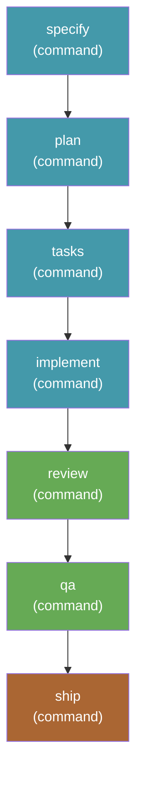

# send-it-checked — spec to PR, unattended, with review and QA

[`send-it`](../send-it/) with a staff review and a QA pass inserted before the
ship step. Still unattended end to end; still ends in an open pull request.

```bash
specify workflow run send-it-checked -i spec="add dark mode" -i target_branch=main
```

## Why this exists

`send-it` skips review and QA. That is not a waiver — ship's pre-flight review
and QA checks are gated on `FEATURE_DIR/reviews/` and `FEATURE_DIR/qa/`
existing, and in a `send-it` run they never do, so pre-flight passes honestly
with nothing to check.

`send-it-checked` makes those directories exist. `speckit.staff-review.run`
writes to `reviews/` and `speckit.qa.run` writes to `qa/`, so ship's pre-flight
gates are real: it reads the most recent report of each and reacts to the
verdict.

## What it needs

Three third-party extensions: [`ship`](https://github.com/arunt14/spec-kit-ship),
[`staff-review`](https://github.com/arunt14/spec-kit-staff-review), and
[`qa`](https://github.com/arunt14/spec-kit-qa). None of these commands are core
Spec Kit. Install the [`send-it` bundle](../../bundles/send-it/), which pins all
of them.

## Inputs

| Input | Required | Default | Description |
|---|---|---|---|
| `spec` | yes | — | What you want built. Passed to the first four steps. |
| `integration` | no | `auto` | Which agent integration to dispatch to. `auto` uses whatever the project was initialized with. |
| `target_branch` | no | `main` | The branch the pull request targets. |

## Steps



| Step | Command | Provided by |
|---|---|---|
| `specify` | `speckit.specify` | core |
| `plan` | `speckit.plan` | core |
| `tasks` | `speckit.tasks` | core |
| `implement` | `speckit.implement` | core |
| `review` | `speckit.staff-review.run` | `staff-review` extension |
| `qa` | `speckit.qa.run` | `qa` extension |
| `ship` | `speckit.ship.run` | `ship` extension |

Note that `/speckit.review` and `/speckit.qa`, which ship's own README
name-drops, do not exist as core commands. `speckit.staff-review.run` and
`speckit.qa.run` are the real ones.

## The remediation policy

Both checks get exactly one fix-and-re-run pass:

- **Review:** on CHANGES REQUIRED, fix every Blocker finding, re-run the review
  once, then move on whatever the second verdict says.
- **QA:** on FAILURES FOUND, fix the failing scenarios, re-run QA once, then
  move on whatever the second verdict says.

Anything still outstanding after that pass does **not** stop the ship. It goes
into the pull request description under a "Known issues" heading. The pull
request stays the gate — the checks exist to make it a better-informed one, not
to block an unattended run indefinitely.

## Caveats

- **Everything in [`send-it`'s caveats](../send-it/README.md#caveats) applies.**
- **Verdict handling is agent-interpreted.** Ship reads the review and QA
  reports and reasons about the verdict; there is no machine-readable status
  field. The reports are markdown and the emoji upstream uses for a
  "changes required" verdict is not identical across the two extensions.
- **QA mode selection is a heuristic.** The step asks for CLI QA unless browser
  automation is clearly already configured. On a web project without Playwright
  installed you get CLI QA, which is shallower than browser QA would be.
- **Two extra full agent passes.** This is meaningfully slower and more
  expensive than `send-it`. Use `send-it` when you already trust the change.

## Changelog

See [CHANGELOG.md](CHANGELOG.md).
