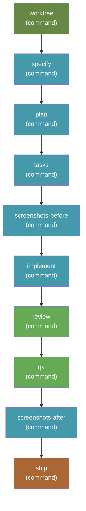

# send-it-checked — spec to PR, unattended, with review and QA

[`send-it`](../send-it/) with a staff review and a QA pass inserted before the
ship step. Still unattended end to end; still ends in an open pull request.

```bash
specify workflow run send-it-checked -i spec="add dark mode" -i target_branch=main
```

## Requires

| Extension | Why |
|---|---|
| [`worktrees`](https://github.com/clintcparker/speckit-addons/tree/main/extensions/worktrees) **≥ 2.4.0** | The `worktree` step dispatches `speckit.worktrees.create`, and relies on the concurrency lock added in 2.4.0 (plus the run context file from 2.3.0, the `session` field from 2.2.0 and the idempotent case detection from 2.1.0) |
| [`ship`](https://github.com/arunt14/spec-kit-ship) | The `ship` step dispatches `speckit.ship.run` |
| [`staff-review`](https://github.com/arunt14/spec-kit-staff-review) | The `review` step dispatches `speckit.staff-review.run` |
| [`qa`](https://github.com/arunt14/spec-kit-qa) | The `qa` step dispatches `speckit.qa.run` |
| [`screenshots`](https://github.com/clintcparker/speckit-addons/tree/main/extensions/screenshots) | The two capture steps dispatch `speckit.screenshots.capture` |

All five are hard dependencies: a missing extension means the step fails at
dispatch. Spec Kit's workflow schema cannot declare this — `requires` accepts
only `speckit_version` and `integrations` — so install them first:

```bash
specify extension catalog add \
  https://raw.githubusercontent.com/clintcparker/speckit-addons/main/extensions/catalog.json \
  --name speckit-addons --install-allowed --priority 5
specify extension add worktrees
specify extension add ship
specify extension add staff-review
specify extension add qa
specify extension add screenshots
```

The worktree-first flow this workflow assumes additionally wants the `git`
extension — see [docs/send-it-harness.md](../../docs/send-it-harness.md).

### How the steps agree on which feature they are building

The engine has no step-output templating — a step receives its own `args` and
nothing else, not the worktree step's report and not the previous step's output.
Left to themselves, every step answers "which feature is this?" from the current
branch and `.specify/feature.json`, and an unattended run's session is usually
standing in the *primary* checkout, where right after a merge both name the
feature that just shipped. That is not hypothetical: two concurrent runs once
implemented their features correctly and then reviewed, QA'd, screenshotted and
shipped the previous, already-merged one.

So the `worktree` step writes `.specify/run-context.json` — branch, absolute
feature directory, worktree path, isolation and session — and every step after
it carries an explicit instruction to resolve `FEATURE_DIR` from that file,
never from the branch or `feature.json`, and to **fail loudly** rather than
adopt a feature the run context does not name. A helper script exiting 0 is not
evidence it found the right one: `setup-plan.sh` exits 0 on the wrong feature
and plants a template `plan.md` there. `ship` goes further and refuses to
commit, push, or open a pull request at all when the run context is missing or
disagrees.

That instruction is repeated verbatim in every step's `args`. It has to be —
there is nowhere else to put it.

### Why `worktree` is a step and not just a hook

The `worktrees` extension registers `speckit.worktrees.create` on `before_specify`,
which is enough *only when a run actually starts at `specify`*. A resumed run, or a
fix-up over a feature that was already specified, enters at a later step, never
triggers the hook, and executes entirely in the primary checkout — and by the time
anyone notices, `git worktree add` for that branch is impossible until the primary
moves off it. Declaring it as an explicit first step closes that hole; the command
is idempotent, so when the hook does fire it finds the session already isolated and
no-ops.

## Why this exists

`send-it` skips review and QA. That is not a waiver — ship's pre-flight review
and QA checks are gated on `FEATURE_DIR/reviews/` and `FEATURE_DIR/qa/`
existing, and in a `send-it` run they never do, so pre-flight passes honestly
with nothing to check.

`send-it-checked` makes those directories exist. `speckit.staff-review.run`
writes to `reviews/` and `speckit.qa.run` writes to `qa/`, so ship's pre-flight
gates are real: it reads the most recent report of each and reacts to the
verdict.

## Inputs

| Input | Required | Default | Description |
|---|---|---|---|
| `spec` | yes | — | What you want built. Passed to `specify`, `plan`, `tasks`, and `implement`. |
| `integration` | no | `auto` | Which agent integration to dispatch to. `auto` uses whatever the project was initialized with. |
| `target_branch` | no | `main` | The branch the pull request targets. |

## Steps



| Step | Command | Provided by |
|---|---|---|
| `worktree` | `speckit.worktrees.create` | `worktrees` extension |
| `specify` | `speckit.specify` | core |
| `plan` | `speckit.plan` | core |
| `tasks` | `speckit.tasks` | core |
| `screenshots-before` | `speckit.screenshots.capture` | `screenshots` extension |
| `implement` | `speckit.implement` | core |
| `review` | `speckit.staff-review.run` | `staff-review` extension |
| `qa` | `speckit.qa.run` | `qa` extension |
| `screenshots-after` | `speckit.screenshots.capture` | `screenshots` extension |
| `ship` | `speckit.ship.run` | `ship` extension |

Note that `/speckit.review` and `/speckit.qa`, which ship's own README
name-drops, do not exist as core commands. `speckit.staff-review.run` and
`speckit.qa.run` are the real ones.

## The remediation policy

Both checks get exactly one fix-and-re-run pass:

- **Review:** on CHANGES REQUIRED, fix every Blocker finding, re-run the review
  once, then move on whatever the second verdict says.
- **QA:** on FAILURES FOUND, fix the failing scenarios, re-run QA once, then
  move on whatever the second verdict says.

Anything still outstanding after that pass does **not** stop the ship. It goes
into the pull request description under a "Known issues" heading. The pull
request stays the gate — the checks exist to make it a better-informed one, not
to block an unattended run indefinitely.

## Caveats

- **Everything in [`send-it`'s caveats](../send-it/README.md#caveats) applies.**
- **One unattended run per primary checkout.** When the session cannot move into
  the worktree, the run context pointer in the primary checkout is what later
  steps find, and there is only one of it. A second concurrent run is reported
  as `run_context=collision` and surfaced in the pull request rather than
  silently repointing the first — loud, but still not supported.
- **Verdict handling is agent-interpreted.** Ship reads the review and QA
  reports and reasons about the verdict; there is no machine-readable status
  field. The reports are markdown and the emoji upstream uses for a
  "changes required" verdict is not identical across the two extensions.
- **QA mode selection is a heuristic.** The step asks for CLI QA unless browser
  automation is clearly already configured. On a web project without Playwright
  installed you get CLI QA, which is shallower than browser QA would be.
- **Two extra full agent passes.** This is meaningfully slower and more
  expensive than `send-it`. Use `send-it` when you already trust the change.

## Changelog

See [CHANGELOG.md](CHANGELOG.md).
