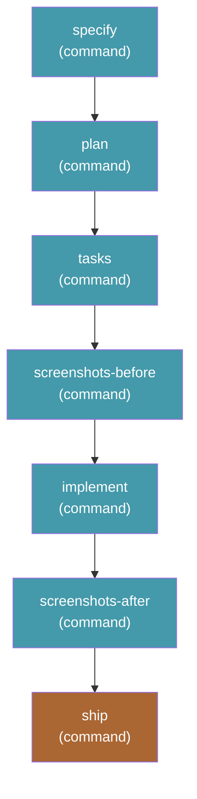

# send-it — spec to PR, unattended

Runs the complete Spec Kit cycle and then ships it: `specify` → `plan` →
`tasks` → `screenshots (before)` → `implement` → `screenshots (after)` →
`ship`. No review gates, no confirmations, no pauses. You describe what you
want and come back to an open pull request with before/after UI screenshots.

```bash
specify workflow run send-it -i spec="add dark mode" -i target_branch=main
```

The pull request is the review gate. That is the whole design.

## Requires

| Extension | Why |
|---|---|
| [`ship`](https://github.com/arunt14/spec-kit-ship) | The `ship` step dispatches `speckit.ship.run` |
| [`screenshots`](https://github.com/clintcparker/speckit-addons/tree/main/extensions/screenshots) | The two capture steps dispatch `speckit.screenshots.capture` |

Both are hard dependencies: a missing extension means the step fails at dispatch.
Spec Kit's workflow schema cannot declare this — `requires` accepts only
`speckit_version` and `integrations` — so install them first:

```bash
specify extension catalog add \
  https://raw.githubusercontent.com/clintcparker/speckit-addons/main/extensions/catalog.json \
  --name speckit-addons --install-allowed --priority 5
specify extension add ship screenshots
```

The worktree-first flow this workflow assumes additionally wants the `worktrees`
and `git` extensions — see [docs/send-it-harness.md](../../docs/send-it-harness.md).

## What it needs

`send-it` calls `speckit.ship.run`, which is **not** a core Spec Kit command —
it comes from the third-party [`ship`](https://github.com/arunt14/spec-kit-ship)
extension. Installing this workflow on its own gives you a run that fails at the
last step.

Install the [`send-it` bundle](../../bundles/send-it/) instead. It pins and
installs `ship` alongside the `worktrees` extension that gives each run its own
git worktree, plus this workflow and its checked sibling.

## Inputs

| Input | Required | Default | Description |
|---|---|---|---|
| `spec` | yes | — | What you want built. Passed to the first four steps. |
| `integration` | no | `auto` | Which agent integration to dispatch to. `auto` uses whatever the project was initialized with. |
| `target_branch` | no | `main` | The branch the pull request targets. |

## Steps



| Step | Command | Provided by |
|---|---|---|
| `specify` | `speckit.specify` | core |
| `plan` | `speckit.plan` | core |
| `tasks` | `speckit.tasks` | core |
| `screenshots-before` | `speckit.screenshots.capture` | `screenshots` extension |
| `implement` | `speckit.implement` | core |
| `screenshots-after` | `speckit.screenshots.capture` | `screenshots` extension |
| `ship` | `speckit.ship.run` | `ship` extension |

## How the unattended part works

`speckit.ship.run` is safe by default: it asks for explicit confirmation before
every rebase, push, changelog write, and PR creation. Its command file reads
`$ARGUMENTS` first and says "You **MUST** consider the user input before
proceeding". The `ship` step's `args` uses exactly that lever — it declares the
run unattended and pre-answers every confirmation.

Three consequences worth knowing:

- **This is prompt-level, not mechanical.** If an agent declines to honour the
  instruction, the run stalls waiting for input. It does not push something you
  did not ask for — the failure direction is the safe one.
- **Manual `/speckit.ship.run` is unaffected.** Nothing is forked or patched;
  running the command yourself keeps all of its prompts.
- **One stop is deliberate.** A rebase conflict that cannot be resolved
  trivially leaves the branch alone for you to fix by hand.

`send-it` skips review and QA entirely. That is honest rather than waived:
ship's review and QA pre-flight checks only run when `FEATURE_DIR/reviews/` and
`FEATURE_DIR/qa/` exist, and with no review or QA step in this workflow they
never do. If you want those gates, use
[`send-it-checked`](../send-it-checked/).

## Caveats

- **No review gates, and it pushes.** `yolo` could go wrong on a branch you
  throw away. `send-it` ends with a pull request against `target_branch`. Point
  it somewhere you are happy to see a PR.
- **CI is reported, never waited on.** A red build still opens a PR, with the
  failure called out in the description.
- **A vague `spec` produces a confident, fast, wrong pull request.** Removing the
  interruptions does not remove the need to know what you want.

## Changelog

See [CHANGELOG.md](CHANGELOG.md).
