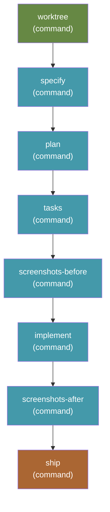

# send-it — spec to PR, unattended

Runs the complete Spec Kit cycle and then ships it: `worktree` → `specify` →
`plan` → `tasks` → `screenshots (before)` → `implement` → `screenshots (after)`
→ `ship`. No review gates, no confirmations, no pauses. You describe what you
want and come back to an open pull request with before/after UI screenshots.

```bash
specify workflow run send-it -i spec="add dark mode" -i target_branch=main
```

The pull request is the review gate. That is the whole design.

## Requires

| Extension | Why |
|---|---|
| [`worktrees`](https://github.com/clintcparker/speckit-addons/tree/main/extensions/worktrees) **≥ 2.4.0** | The `worktree` step dispatches `speckit.worktrees.create`, and relies on the concurrency lock added in 2.4.0 (plus the run context file from 2.3.0, the `session` field from 2.2.0 and the idempotent case detection from 2.1.0) |
| [`ship`](https://github.com/arunt14/spec-kit-ship) | The `ship` step dispatches `speckit.ship.run` |
| [`screenshots`](https://github.com/clintcparker/speckit-addons/tree/main/extensions/screenshots) | The two capture steps dispatch `speckit.screenshots.capture` |

All three are hard dependencies: a missing extension means the step fails at
dispatch. Spec Kit's workflow schema cannot declare this — `requires` accepts only
`speckit_version` and `integrations` — so install them first:

```bash
specify extension catalog add \
  https://raw.githubusercontent.com/clintcparker/speckit-addons/main/extensions/catalog.json \
  --name speckit-addons --install-allowed --priority 5
specify extension add worktrees
specify extension add ship
specify extension add screenshots
```

The worktree-first flow this workflow assumes additionally wants the `git`
extension — see [docs/send-it-harness.md](../../docs/send-it-harness.md).

### Why `worktree` is a step and not just a hook

The `worktrees` extension registers `speckit.worktrees.create` on `before_specify`,
which is enough *only when a run actually starts at `specify`*. A resumed run, or a
fix-up over a feature that was already specified, enters at a later step, never
triggers the hook, and executes entirely in the primary checkout — and by the time
anyone notices, `git worktree add` for that branch is impossible until the primary
moves off it. Declaring it as an explicit first step closes that hole; the command
is idempotent, so when the hook does fire it finds the session already isolated and
no-ops.

## Inputs

| Input | Required | Default | Description |
|---|---|---|---|
| `spec` | yes | — | What you want built. Passed to `specify`, `plan`, `tasks`, and `implement`. |
| `integration` | no | `auto` | Which agent integration to dispatch to. `auto` uses whatever the project was initialized with. |
| `target_branch` | no | `main` | The branch the pull request targets. |

## Steps



| Step | Command | Provided by |
|---|---|---|
| `worktree` | `speckit.worktrees.create` | `worktrees` extension |
| `specify` | `speckit.specify` | core |
| `plan` | `speckit.plan` | core |
| `tasks` | `speckit.tasks` | core |
| `screenshots-before` | `speckit.screenshots.capture` | `screenshots` extension |
| `implement` | `speckit.implement` | core |
| `screenshots-after` | `speckit.screenshots.capture` | `screenshots` extension |
| `ship` | `speckit.ship.run` | `ship` extension |

## How the unattended part works

`speckit.ship.run` is safe by default: it asks for explicit confirmation before
every rebase, push, changelog write, and PR creation. Its command file reads
`$ARGUMENTS` first and says "You **MUST** consider the user input before
proceeding". The `ship` step's `args` uses exactly that lever — it declares the
run unattended and pre-answers every confirmation.

Three consequences worth knowing:

- **This is prompt-level, not mechanical.** If an agent declines to honour the
  instruction, the run stalls waiting for input. It does not push something you
  did not ask for — the failure direction is the safe one.
- **Manual `/speckit.ship.run` is unaffected.** Nothing is forked or patched;
  running the command yourself keeps all of its prompts.
- **One stop is deliberate.** A rebase conflict that cannot be resolved
  trivially leaves the branch alone for you to fix by hand.

### How the steps agree on which feature they are building

The engine has no step-output templating — a step receives its own `args` and
nothing else, not the worktree step's report and not the previous step's output.
Left to themselves, every step answers "which feature is this?" from the current
branch and `.specify/feature.json`, and an unattended run's session is usually
standing in the *primary* checkout, where right after a merge both name the
feature that just shipped.

So the `worktree` step writes `.specify/run-context.json` — branch, absolute
feature directory, worktree path, isolation and session — and every step after
it carries an explicit instruction to resolve `FEATURE_DIR` from that file,
never from the branch or `feature.json`, and to **fail loudly** rather than
adopt a feature the run context does not name. A helper script exiting 0 is not
evidence it found the right one: `setup-plan.sh` exits 0 on the wrong feature
and plants a template `plan.md` there. `ship` goes further and refuses to
commit, push, or open a pull request at all when the run context is missing or
disagrees.

That instruction is repeated verbatim in every step's `args`. It has to be —
there is nowhere else to put it.

`send-it` skips review and QA entirely. That is honest rather than waived:
ship's review and QA pre-flight checks only run when `FEATURE_DIR/reviews/` and
`FEATURE_DIR/qa/` exist, and with no review or QA step in this workflow they
never do. If you want those gates, use
[`send-it-checked`](../send-it-checked/).

## Caveats

- **No review gates, and it pushes.** `yolo` could go wrong on a branch you
  throw away. `send-it` ends with a pull request against `target_branch`. Point
  it somewhere you are happy to see a PR.
- **CI is reported, never waited on.** A red build still opens a PR, with the
  failure called out in the description.
- **A vague `spec` produces a confident, fast, wrong pull request.** Removing the
  interruptions does not remove the need to know what you want.
- **One unattended run per primary checkout.** When the session cannot move into
  the worktree, the run context pointer in the primary checkout is what later
  steps find, and there is only one of it. A second concurrent run is reported
  as `run_context=collision` and surfaced in the pull request rather than
  silently repointing the first — loud, but still not supported.

## Changelog

See [CHANGELOG.md](CHANGELOG.md).
