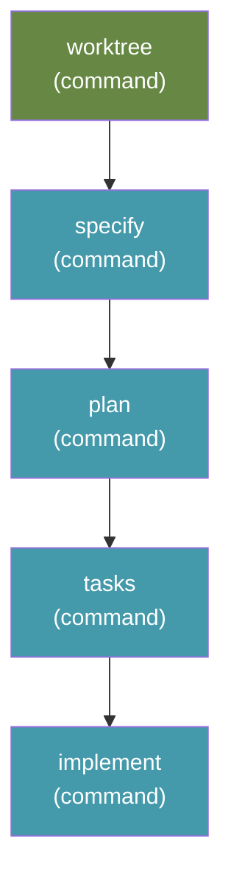

# YOLO — Full SDD Cycle, no gates

Runs the complete Spec Kit cycle — `worktree` → `specify` → `plan` → `tasks` →
`implement` — straight through, with no human review gates in between.

The built-in `speckit` workflow pauses twice: once to review the generated spec,
once to review the plan. YOLO removes both. You describe what you want, walk
away, and come back to a finished branch.

```bash
specify workflow run yolo -i spec="make the app do the thing"
```

## Why you might want this

The gates exist for a good reason, and most of the time you should use them. But
when you already trust the shape of the change, the gates are two interruptions
that produce intermediate output you were never going to read carefully anyway.

That trade is only safe because of source control. Run YOLO on a branch. If it
goes sideways, throw the branch away and try again with a better prompt — which
is usually the real fix, since the quality of the result tracks the quality of
what you asked for.

## Install

If you have not already registered this repo's catalog:

```bash
specify workflow catalog add \
  https://raw.githubusercontent.com/clintcparker/speckit-addons/main/workflows/catalog.json
```

Then:

```bash
specify workflow add yolo
```

Or install this one workflow directly, without registering the catalog:

```bash
specify workflow add yolo --from \
  https://raw.githubusercontent.com/clintcparker/speckit-addons/yolo-v0.3.0/workflows/yolo/workflow.yml
```

As of 0.2.0 the first step needs the
[`worktrees`](https://github.com/clintcparker/speckit-addons/tree/main/extensions/worktrees)
extension at **2.4.0 or later**, and fails at dispatch without it. Spec Kit's
workflow schema cannot declare an extension dependency — `requires` accepts only
`speckit_version` and `integrations` — so install it yourself:

```bash
specify extension catalog add \
  https://raw.githubusercontent.com/clintcparker/speckit-addons/main/extensions/catalog.json \
  --name speckit-addons --install-allowed --priority 5
specify extension add worktrees
```

If you do not want worktree isolation, stay on `yolo-v0.1.1`.

## Inputs

| Input | Required | Default | Description |
|---|---|---|---|
| `spec` | yes | — | What you want built. Passed to every step. |
| `integration` | no | `auto` | Which agent integration to dispatch to. `auto` uses whatever the project was initialized with. |

Supply `spec` on the command line with `-i spec="..."`, or leave it off and
Spec Kit will prompt for it.

## Steps

Five `command` steps, no gates, no shell:

| Step | Command | Provided by |
|---|---|---|
| `worktree` | `speckit.worktrees.create` | `worktrees` extension |
| `specify` | `speckit.specify` | core |
| `plan` | `speckit.plan` | core |
| `tasks` | `speckit.tasks` | core |
| `implement` | `speckit.implement` | core |



`worktree` is a **step**, not just the `worktrees` extension's `before_specify`
hook, because the hook only fires when a run actually starts at `specify`. A
resumed run, or a fix-up over an already-specified feature, enters later, never
triggers the hook, and executes in the primary checkout — after which
`git worktree add` for that branch is impossible until the primary moves off it.
The command is idempotent, so when the hook does fire it finds the session
already isolated and no-ops.

For contrast, the built-in `speckit` workflow interposes a `gate` step after
`specify` and again after `plan`, each of which pauses the run until you approve
it. YOLO is that graph with the two gates removed.

### How the steps agree on which feature they are building

The engine has no step-output templating — a step receives its own `args` and
nothing else, not the previous step's output. Left to themselves, `specify`,
`plan`, `tasks` and `implement` each answer "which feature is this?" from the
current branch and `.specify/feature.json`, and an unattended run's session is
usually standing in the *primary* checkout, where right after a merge both name
the feature that just shipped.

So the `worktree` step writes `.specify/run-context.json` — branch, absolute
feature directory, worktree path, isolation and session — and every step after
it carries an explicit instruction to resolve `FEATURE_DIR` from that file,
never from the branch or `feature.json`, and to **fail loudly** rather than
adopt a feature the run context does not name. A helper script exiting 0 is not
evidence it found the right one: `setup-plan.sh` exits 0 on the wrong feature
and plants a template `plan.md` there.

That instruction is repeated verbatim in every step's `args`. It has to be —
there is nowhere else to put it.

## Requirements

Spec Kit `>=0.8.12` — the first release that resolves `integration: "auto"`
engine-side ([spec-kit #2421](https://github.com/github/spec-kit/pull/2421)). On
older versions `auto` is treated as a literal integration name and dispatch
fails.

The [`worktrees`](https://github.com/clintcparker/speckit-addons/tree/main/extensions/worktrees)
extension at **2.4.0 or later**, for the `worktree` step — see [Install](#install).

The `requires.integrations` list names `claude` as an advisory compatibility
hint, not a restriction. The four SDD commands are core Spec Kit commands that
every integration provides, so YOLO runs against whatever your project is
initialized with.

## Adding your own steps

Rather than forking this file, use a workflow overlay — your changes then
survive `specify workflow update`. To lint after implementation, for example:

```yaml
id: "add-lint"
extends: "yolo"
priority: 10
edits:
  - insert_after: implement
    step:
      id: run-lint
      type: shell
      run: "ruff check src/"
```

```bash
specify workflow overlay add project-overlay.yml
```

Note that `shell` steps run with your full privileges and are not sandboxed. If
you add one, consider putting a `gate` step in front of it.

## Caveats

- **No review gates.** That is the entire point, and it is a real trade. Use a
  branch.
- **Not a substitute for knowing what you want.** YOLO removes the interruptions,
  not the need for a clear spec. A vague `spec` input produces a confident,
  fast, wrong implementation.

## Changelog

See [CHANGELOG.md](CHANGELOG.md).
